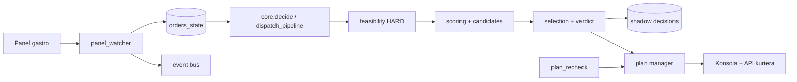

# Bieżąca architektura i runtime

## Przepływ

Warstwy 1–10 z kanonu są fizycznie rozpoznawalne. `dispatch-shadow` jest
silnikiem propozycji; `panel-watcher` jest głównym ingestem; `plan_recheck`
działa timerowo i event-driven; formalny FSM obserwuje legacy writer, ale go nie
zastępuje.

## Stan podczas audytu

`dispatch-shadow`, `dispatch-panel-watcher`, `dispatch-sla-tracker`,
`courier-api` i `nadajesz-panel` były active/running z `NRestarts=0` od ich
ostatnich startów. Procesy silnika uruchamiały kod z kanonicznego katalogu
`scripts`, nie z worktree audytu. Parser health: v2/healthy, bez anomalii.

## Trzy światy flag

- silnik: `flags.json` + hot reload;
- panel: EnvironmentFile/drop-iny + defaulty;
- API kuriera: drop-iny + config.

Po flipie `USE_V2_PARSER` kanon wartości jest w `flags.json`, lecz pozostał env
carrier panel-watchera. To już nie `known-open` cross-service, tylko jawny dług
usunięcia martwego nośnika. Stary test nie został zaktualizowany.

## Ocena

Architektura kierunkowa jest spójna z dokumentami, ale granice czystego rdzenia są
niepełne: proces-globalne cache/bufory i live inputs ograniczają determinizm
replayu. Szczegóły w raportach 03, 10 i 12.
