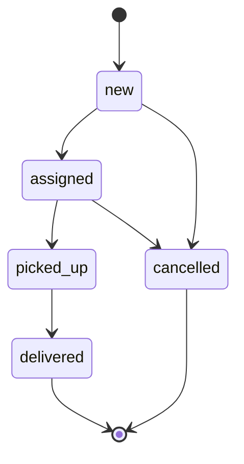

# Lifecycle zlecenia i FSM

## Stan faktyczny

`state_machine` pozostaje writerem prawdy legacy. `order_fsm` waliduje przejścia
jako observer fail-open; enforcement nie jest podłączony i nie ma bezpiecznego
„flipa”. Retry/DLQ Fazy A dostarcza metadane oraz ręczny replay, ale nie ma
automatycznej polityki, workera ani harmonogramu.

Diagram jest modelem uproszczonym; reconcile i korekty faktów wymagają jawnych
źródeł. Odzyskany finding `SPRI-08` sugeruje, że re-emit pickup z dokładniejszym
czasem może wyglądać jak nielegalne samo-przejście. To P3/UNVERIFIED do czasu
reprodukcji na anonimowym fixture.

## Ryzyka przed Fazą B

- uzgodnić semantykę korekt timestampów i idempotencji;
- nie uruchamiać enforcementu bez replayu pełnego grafu;
- policy retry musi rozróżniać transient i poison oraz chronić efekty przed
  duplikacją;
- 106 historycznych failed nie jest automatycznie backlogiem do bezwarunkowego
  replayu.
