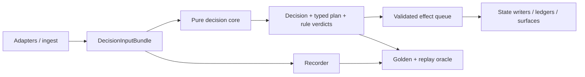

# Architektura docelowa i plan refaktoru

## Cel

Docelowy dispatcher ma mieć tę samą semantykę biznesową, lecz mniej ukrytych
kanałów stanu i jeden odtwarzalny kontrakt wejście→decyzja→plan→efekty.

## Kontrakty docelowe

| Obecny problem | Kontrakt docelowy | Dowód migracji |
|---|---|---|
| live inputs czytane w wielu miejscach | niemutowalny `DecisionInputBundle` z wersją i fingerprintem | replay byte/decision parity |
| plan solvera i plan utrwalony różnią się | typowany `PlanV2` z kolejnością eventów, metodą i provenance | parity decyzja→plik→API→apka |
| writerzy cross-repo bez wspólnego CAS | `PlanStore` z obowiązkowym expected version i ownerem | test race dwóch procesów |
| trzy światy flag | rejestr `flag→kanon→carrier→consumer→effective process` | checker na syntetycznych unitach |
| procesowe cache/EWMA | stan jawnie w context albo wersjonowany store | dwa świeże procesy dają ten sam wynik |
| zielony monitor bez oracle | każdy monitor ma denominator, freshness, exit semantics i negative control | mutation tripwire czerwieni instrument |
| efekty po decyzji tylko w pamięci | idempotentna kolejka efektów z reason code i obserwowalnym flush | kill/restart fixture bez utraty/duplikacji |

## Fale refaktoru

1. **Fala R0 — instrumenty:** naprawić TEST-11, zdefiniować mianowniki i negative
   controls. Zero zmiany decyzji.
2. **Fala R1 — plan boundary:** TRAS-01/02 + DANE-01 w jednym kontrakcie. Flaga
   OFF/shadow, parity wszystkich powierzchni.
3. **Fala R2 — record/replay:** pełny input bundle i strict OSRM provenance.
   Najpierw golden case, potem gate.
4. **Fala R3 — context:** usuwać po jednym globalnym cache/flag channel, każda fala
   z bajtowym parytetem i entropy dashboard.
5. **Fala R4 — durable effects:** dopiero po zdefiniowaniu idempotencji i policy
   retry; FSM nadal observer aż do osobnego werdyktu.

## Warunki stop

- Każda zmiana HARD/SOFT lub precedencji wraca do Adriana.
- Brak oracle albo spadek coverage zatrzymuje falę.
- Refaktor bez parytetu nie przechodzi do deployu.
- Cross-repo writer bez wspólnego testu race blokuje merge.
- Ten dokument nie jest zgodą na implementację ani release.
