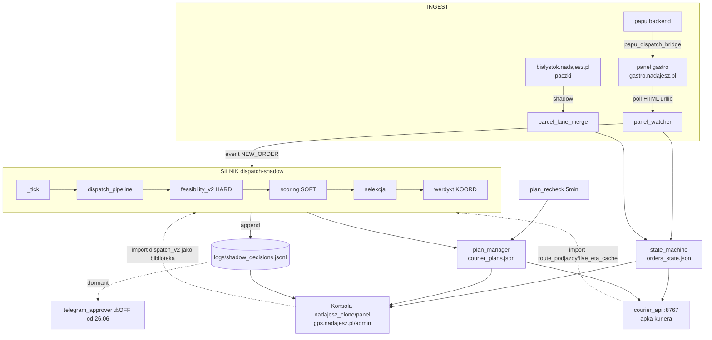

# ARCHITEKTURA ZIOMKA — mapa nawigacyjna (START TUTAJ)

> **STATUS: żywy dokument nawigacyjny** · data 2026-07-03 · cel = nowa sesja orientuje się w systemie w kilka minut.
> Aktualizuj przy KAŻDEJ zmianie architektury (nowa warstwa/demon/most/repo).
> **To jest mapa, nie kanon.** Kontrakty, inwarianty i „jak zmieniać" żyją osobno:
> - **`../ZIOMEK_ARCHITECTURE.md`** — 10 warstw + 6 filarów + 8 kontraktów + rejestr bliźniaków (kanon, zatw. Adrian 01.07).
> - **`../ZIOMEK_INVARIANTS.md`** — co MUSI być zawsze prawdą + strażnicy.
> - **`../ZIOMEK_DEFINITION_OF_DONE.md`** — DoD na 1 ekran.
> - **`memory/ziomek-change-protocol.md`** — ⛔ Przykazanie #0: JAK bezpiecznie zmieniać (ETAP 0→7). Czytaj PIERWSZE przed dotknięciem kodu.
> Dowody i pełne tabele źródłowe: `audyt/00`–`audyt/05` (Faza 0 audytu). Ten plik = synteza `audyt/01-ZALEZNOSCI.md`.

---

## 1. Big picture — czym jest Ziomek

Ziomek to **autonomiczny dispatcher kurierski** dla NadajeSz w Białymstoku (jedzenie + od 29.06 paczki). Zlecenia wpadają z panelu gastro, silnik ocenia każde przez **10-warstwowy pipeline** (HARD-before-SOFT: najpierw twarde odrzuty, potem kary miękkie, selekcja, werdykt), liczy trasy przez OSRM + OR-Tools (TSP), i **proponuje** przypisanie kuriera. Tryb dziś = **CIEŃ (shadow-proposals)**: Ziomek proponuje, **człowiek-koordynator przydziela** przez konsolę. Pełna autonomia (auto-assign) jest **zbudowana, ale za flagą `ENABLE_AUTO_ASSIGN` OFF** — pierwsze realne auto-przypisanie musi być nadzorowane (AUTON-01). Serce systemu to demon `dispatch-shadow` (pętla `_tick`), obok niego ~60 timerów obsługuje kolejki, re-sekwencje planów i monitory. System działa na Hetznerze (UTC), stan runtime (1,1 GB) leży **poza gitem**. Główny nurt rozwoju = spójność architektury (audyt Fazy 1/2, walka z „regułą w N kopiach").

---

## 2. 10 warstw pipeline (zlecenie → decyzja)

Kanon: `../ZIOMEK_ARCHITECTURE.md §1`. Zweryfikowane vs kod 03.07 (`audyt/01 §2`). **HARD = nieprzekraczalne, przed SOFT.**

| # | Warstwa (typ) | Moduł(y) | Symbol / co robi |
|---|---|---|---|
| 1 | wejście | `panel_watcher.py` + `panel_client.py` | poll gastro → normalizacja → event NEW_ORDER |
| 2 | **geokod — HARD** | `common.py`, `geocoding.py`, `osrm_client.py` | `coords ∈ bbox Białystok` lub odrzut (grep: `coords_in_bialystok_bbox`) |
| 3 | **early-bird / czasówka — HARD** | `czasowka_scheduler.py` + `czasowka_proactive/` | ≥60 min naprzód → hold KOORD |
| 4 | telemetria | `courier_resolver.py` | `dispatchable_fleet()` wzbogaca snapshot floty (GPS+fallback) |
| 5 | **check_feasibility_v2 — HARD** | `feasibility_v2.py` | R6=35/40 tier-aware, R-DECLARED-TIME, shift |
| 6 | scoring ~19 kar (SOFT) | `scoring.py` | `score_candidate()` — term + suma kar/bonusów |
| 7 | selekcja (SOFT) | `dispatch_pipeline.py` | `_selection_bucket` / `_best_effort_*` / lex_qual |
| 8 | **werdykt KOORD — HARD** | `dispatch_pipeline.py` + `shadow_dispatcher.py` | quality-gate vs operational-gate (KOORD-redirect) |
| 9 | zapis + kanon | `plan_manager.py`, `plan_recheck.py` | `courier_plans.json` (atomic) + recanon kolejności |
| 10 | powierzchnie | konsola, apka, ~~Telegram~~ | render kolejności + ETA (patrz §4: TG uśpiony) |

**Pętla silnika** = `shadow_dispatcher._tick()`. **Poza tickiem:** `plan_recheck` (5 min, re-sekwencja), 4 handlery recanon w `panel_watcher`, most paczki, cross-repo konsola/apka. ⚠ Ta sama reguła często żyje w kilku warstwach naraz (feasibility↔greedy↔plan_recheck) — źródło długu K1, patrz rejestr bliźniaków `../ZIOMEK_ARCHITECTURE.md §4`.

**Refaktor 06.07 (program `docs/refaktor/00-07`, raport = `06-raport.md`):** warstwy 2-8 mają fizyczny rdzeń w `core/` — wejście przez fasadę `core/decide.py` (`decide(world, order)` + `WorldState`; `dispatch_pipeline._assess_order_impl` = orkiestrator ~483 l.): bramki wejściowe `core/gates.py` (geokod-defense, early-bird), pętla per-kurier `core/candidates.py` (route-sim+feasibility per kandydat), selekcja+tiering+best_effort+bramki werdyktu `core/selection.py`, interfejs scoringu `core/scorer.py` (ADR-R06, flaga OFF), wspólna parametryzacja planowania `core/planner.py` (silnik↔plan_recheck, ADR-R03). Wejścia decyzji nagrywane: `world_record.py` (→ `dispatch_state/world_record/*.jsonl`, LIVE) + zamrożone flagi/tick (`common.flags_snapshot_*`, LIVE) + efekty uboczne po decyzji (`effects_buffer.py`, LIVE). Weryfikacja „bez zmiany zachowania" = replay: `tools/world_replay.py` (1 decyzja) + `tools/world_replay_gate.py` (korpus; night-guard w `systemd/`, instalacja za ACK).

---

## 3. Przepływ danych end-to-end

Zlecenie wchodzi przez `panel_watcher` (poll HTML gastro), ląduje w `orders_state.json` i wyzwala tick silnika, który przechodzi 10 warstw i **dopisuje decyzję do `shadow_decisions.jsonl`** (kanoniczny log) oraz zapisuje kolejność do `courier_plans.json`. **Telegram (`telegram_approver`) jest UŚPIONY od 26.06** (czysty stop, exit 0) — to była historyczna powierzchnia „człowieka", dziś **dormant do decyzji Adriana** (WD-12 w `audyt/10-PLAN.md`). **Powierzchnie ŻYWE = (a) konsola koordynatora `gps.nadajesz.pl/admin`** (przydział, monitor floty, śledzenie) **i (b) apka kuriera** (`courier_api :8767`). Klient końcowy widzi status paczki na `/sledz`. Kluczowe: konsola i apka nie tylko czytają pliki stanu — **importują `dispatch_v2` jako bibliotekę** (patrz §9).

---

## 4. Punkty wejścia (co uruchamia system)

**5 demonów długobieżnych** (`Type=simple`, ExecStart = `venvs/dispatch/bin/python -m dispatch_v2.X`, cwd `scripts/`):

| Demon | Moduł | Rola |
|---|---|---|
| **dispatch-shadow** | `shadow_dispatcher` | **SILNIK** (pętla `_tick`) |
| dispatch-panel-watcher | `panel_watcher` | INGEST z panelu gastro |
| dispatch-gps | `gps_server` | serwer pozycji GPS |
| dispatch-sla-tracker | `sla_tracker` | monitor SLA/R6 |
| dispatch-monitor-419 | `monitoring.detector_419` | detektor HTTP 419 (disabled, running) |

**Timery wg kadencji** (95 unitów `dispatch-*`, ~60 enabled; `audyt/04 §1c`): **10 s** parcel-merge · **1 min** czasowka / pending-pool / pending-resweep / postpone-sweeper · **2–3 min** carried-first-guard / pickup-floor-guard / plan-recheck / reassign / fleet-position-snapshot / drtusz-bridge / papu-bridge · **5–30 min** data-alerts / eta-calibration / state-reconcile / ground-truth-gc · **dobowe** (03:00–05:00 UTC) state-snapshot / orders-state-prune / log-rotation / koord-cascade / retro-learning · **tygodniowe** cod-weekly (venv sheets) / daily-accounting.

**Crony** (root `crontab -l`, `audyt/01 §1c`): ⚠ **`0 * * * *` `git push origin master` — AUTO-PUSH CO GODZINĘ** (każdy merge do master trafia na GitHub w ≤1 h) · `daily_briefing` 06/20 · kalibracje nocne 04:15/35/45 · `daily_stats_sheets` 06:00 (venv sheets) · ⚠ `tomtom_poc/measure_realworld.py` co 10 min (cron biegnie ze scratchu `eod_drafts/`) · `@reboot` legacy `/root/{gps_server,dispatch_control}.py` (poza pakietem). **At-joby:** ~8 w kolejce (checkpointy werdyktów bieżących sprintów).

---

## 5. Stan i logi

⚠ **PUŁAPKA NAZEWNICZA:** żywy stan silnika = **`/root/.openclaw/workspace/dispatch_state/`** (~318 plików, 1,1 GB, **POZA gitem**). Katalog `dispatch_v2/dispatch_state/` W REPO to **NIE** to samo — zawiera wyłącznie `epaka_data/` (zbieg nazw). Guardy hardkodują ścieżkę absolutną (`common.py:3226`). ⚠ **`shadow_decisions.jsonl` leży w `scripts/logs/`**, a reszta shadow-jsonl (`r6_breach`, `obj_replay`) w `dispatch_state/` — rozdwojenie lokalizacji.

| Plik (żywy stan) | Kto PISZE | Kto CZYTA | Rola |
|---|---|---|---|
| `logs/shadow_decisions.jsonl` (84 MB) | silnik `_serialize_result` | konsola, tools, ~~TG~~ | **kanoniczny log decyzji** |
| `orders_state.json` | `state_machine`, `dispatch_pipeline` | konsola, apka, silnik | prawda o zleceniach |
| `courier_plans.json` | `plan_manager`, `plan_recheck` | konsola, apka, silnik | kanon kolejności/planów |
| `pending_proposals.json` | `panel_watcher`, `postpone_sweeper` | (dawniej TG), tools | propozycje w locie |
| `learning_log.jsonl` (100 MB) | `panel_watcher`, `daily_briefing` | retro/learning | trail TAK/NIE/INNY/KOORD |
| `live_order_eta.json` | `live_eta_cache` | konsola, apka | cache ETA |
| `events.db` (32 MB) | event_bus / silnik | konsumenci eventów | log zdarzeń |
| `courier_api.db` (26 MB) | `courier_api` | apka | stan apki (GPS/token/plany) |
| `courier_last_pos.json` | `courier_resolver` | silnik | last-known-pos (no-GPS) |
| `geocode_cache.json` | `geocoding` | silnik, konsola | cache geokodu |

---

## 6. Środowiska (interpretery + porty)

**Trzy interpretery — świadome rozdzielenie** (`audyt/01 §5`; zawsze absolutna ścieżka w ExecStart):

| Interpreter | Kto używa | Kluczowe pakiety |
|---|---|---|
| **`venvs/dispatch`** (py3.12) | silnik + wszystkie `dispatch-*` + **testy** | ortools 9.15 (TSP), lightgbm/sklearn/pandas/numpy (LGBM+kalibracja), pytest. ⚠ HTTP przez stdlib `urllib` (brak requests/httpx) |
| **`venvs/sheets`** | cod-weekly, daily-accounting, daily_stats | gspread + google-auth + requests (tylko Google Sheets) |
| **`/usr/bin/python3`** (system) | mosty drtusz-bridge, papu-bridge | systemowe; ⚠ **BRAK `ortools`** → naiwny `python3 -m pytest` = 123 fałszywe faile |

**Testy:** `venvs/dispatch/bin/python -m pytest tests/ -q` (baseline **4109/0/23skip/11xfail**, ~2 min). **Porty:** `:5001` OSRM (self-hosted Docker, LIVE) · `:8767` courier-api · `:8765` legacy traccar · `:8888` health/parser (localhost).

---

## 7. Flagi — TRZY ŚWIATY (nie myl!)

Efektywny stan flagi zależy od tego, KTÓRY komponent ją czyta. To główne źródło pomyłek audytora (`audyt/10-PLAN.md` WD-4).

| Świat | Źródło prawdy | Uwaga |
|---|---|---|
| **Silnik** | **`flags.json`** (hot-reload przez `C.flag()`) | Po D3 (02.07) `flags.json` = KANON, env martwy. Różne serwisy = różny env (`dispatch-shadow` ≠ `plan-recheck` ≠ `panel-watcher`). |
| **Panel (konsola)** | `flags.systemd.env` + inline drop-in `.conf` | ⚠ **`systemctl show -p Environment` NIE pokazuje zmiennych z `EnvironmentFile`** → łatwo odczytać zły stan. Flagi outward (`COORDINATOR_*_LIVE`, `DISPATCH_PUSH_LIVE`) =1 + `PANEL_ENVIRONMENT=staging`: **stan =1, do weryfikacji Adriana (WD-11)**. |
| **Apka** | drop-in `.conf` + `config.py` defaults | wartości domyślne w kodzie apki, nadpisywane przez conf. |

Rejestr flag i self-test drift: `tools/flag_fingerprint_check` (CLI). Docelowo jeden rejestr (filar F-5).

---

## 8. Cross-repo i mosty

**Konsola i apka IMPORTUJĄ `dispatch_v2` jako bibliotekę** (nie tylko czytają pliki) — to 3-repo współdzielenie kodu = źródło **dryfu bliźniaków** (ta sama reguła w N kopiach; rejestr: `../ZIOMEK_ARCHITECTURE.md §4`, m.in. route-order w 5 kopiach / 3 repa):
- **Konsola** (`nadajesz_clone/panel`, `gps.nadajesz.pl/admin`): `app/integrations/ziomek/{shadow_quote,committed_time,courier_block,courier_provision_bridge}.py`.
- **Apka** (`scripts/courier_api`, `:8767`): `courier_orders.py` importuje `route_podjazdy`, `live_eta_cache`, `orders_state`.

**Mosty zewnętrzne:** OSRM (urllib→Docker `:5001`) · panel gastro (HTTP+CSRF) · **papu-bridge** (lokalka.pl → gastro, timer 5 min) · **drtusz-bridge** (11 firm B2B, timer 5 min) · **epaka** (fetcher CSV → most panelu) · **parcel** (paczki bialystok.nadajesz.pl → konsola). Sekrety = tylko ścieżki (`.secrets/*.env`), nigdy wartości.

---

## 9. Dokąd dalej (odsyłacze)

- **`CODEMAP.md`** — spis treści repo „gdzie szukać czego" + pułapki nawigacyjne + indeks historii audytów.
- **`decisions/`** — ADR-001..008 (dlaczego 10 warstw, flagi „3 światy", shadow-first, stan poza repo, venv split, worktree, rdzeń-nie-przenoszony).
- **`audyt/00`–`audyt/05` + `audyt/01a`** — raporty Fazy 0 (inwentaryzacja, zależności, niezgodności, dług, testy, inne projekty).
- **`audyt/10-PLAN.md`** — plan porządków + rejestr WD (decyzje Adriana).
- **Kanon w repo:** `../ZIOMEK_ARCHITECTURE.md`, `../ZIOMEK_INVARIANTS.md`, `../ZIOMEK_DEFINITION_OF_DONE.md`, `../CLAUDE.md` (CRITICAL PATHS), `../TECH_DEBT.md`, `../LESSONS.md`.
- **Protokół zmian:** `memory/ziomek-change-protocol.md` (⛔ #0) — czytaj przed każdą zmianą.
