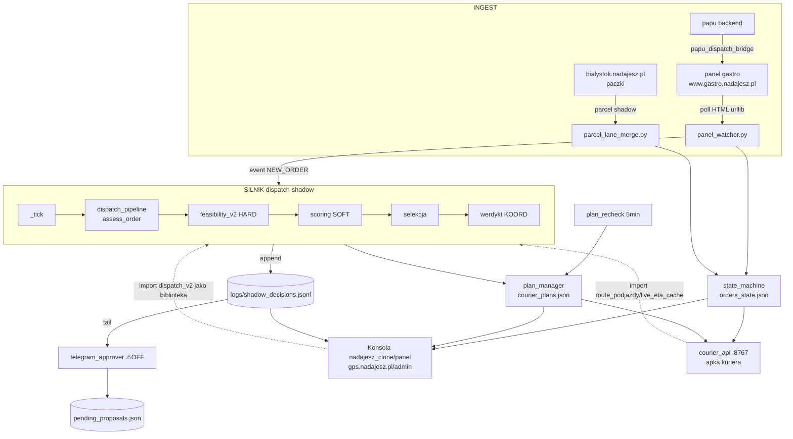

# 01 — ARCHITEKTURA I ZALEŻNOŚCI (Agent B)

**Data:** 2026-07-03 ~11:40 UTC · **Zakres:** dispatch_v2 (żywe repo produkcyjne) + punkty wejścia systemd/cron/at + graf importów + zależności + integracje cross-repo.
**Metoda:** READ-ONLY. AST-graf importów (skrypt w `/tmp`, po 815 `.py` z pominięciem `eod_drafts/AUDIT_*/*.bak-*/__pycache__`); `systemctl show/list-timers/cat`, `grep`, `git log/ls-files` (odczyt); `pip freeze` z interpreterów z ExecStart. **Ścieżka:linia = snapshot 2026-07-03** (repo mutuje na żywo — patrz ⚠ #3). Katalogowałem rozjazdy doc↔kod, nie rozstrzygałem.

---

## 1. PUNKTY WEJŚCIA

### 1a. Demony długo-żyjące (Type=simple, zawsze ON)
Katalog roboczy wszystkich: `/root/.openclaw/workspace/scripts` · interpreter `venvs/dispatch/bin/python` · uruch. `-m dispatch_v2.X`.

| Jednostka | Rola | enabled | active (03.07) |
|---|---|---|---|
| **dispatch-shadow** | **SILNIK** (`shadow_dispatcher`, tick-loop) | disabled\* | **active** |
| dispatch-gps | serwer GPS (`gps_server`, stdlib http) | enabled | active |
| dispatch-panel-watcher | INGEST z panelu gastro (`panel_watcher`) | enabled | active |
| **dispatch-telegram** | approver propozycji (`telegram_approver`) | **disabled** | **inactive/dead** ⚠#1 |

\* `dispatch-shadow` = `disabled` w unit-file, ale `active` (uruchamiany przez zależność/ręcznie, restart on-failure). Telegram: czysty stop `Jun 26 19:56` (exit 0) — patrz ⚠#1.

### 1b. Timery — skala i wzorce
**72 usługi `dispatch-*.service` + 65 timerów `dispatch-*.timer`** (+ `gps-delivery-validation`, `nadajesz-parcel-shadow` w sąsiedztwie). Wzorce:
- **Wysokoczęste tiki** (OnUnitActiveSec 30s–5min) = pętla operacyjna obok silnika: `dispatch-plan-recheck` (5min, re-sekwencja kanonu), `dispatch-czasowka` (1min), `dispatch-pending-pool` (1min), `dispatch-pending-resweep-shadow` (1min), `dispatch-postpone-sweeper` (1min), `dispatch-parcel-merge` (30s), `dispatch-reassign*`/`carried-first-guard`/`pickup-floor-guard`/`fleet-position-snapshot`/`liveness-probe` (2–3min).
- **Nocne raporty/GC** (OnCalendar): `state-snapshot` 03:00, `orders-state-prune` 03:30, `log-rotation` 03:00, `koord-cascade` 03:00, `retro-learning` 04:30, `event-bus-cleanup` 04:00, `restic-backup` 03:30, `daily-rule-report` 21:30, `pickup-slip-monitor` 22:30.
- **Tygodniowe biznes**: `cod-weekly*` (Mon 07/08:30 Warsaw, venv **sheets**), `daily-accounting` (Tue–Fri+Mon 06:00, venv **sheets**).
- **⚠ WYSTRZELONE one-shoty** (OnCalendar w przeszłości — inert, kandydaci na sprzątanie): `objm-lexr6-smoke-{flip,verdict,summary}` (06-26), `pending-resweep-{review,watchdog}` (06-26), `reassignment-shadow-eval` (06-27), `b-route-shadow-review` (06-30), `bundle-calib-review` (07-02). Przyszły: `pickup-slip-review` 07-04.

### 1c. Crony (root `crontab -l`; brak refów w `/etc/cron.d`)
| Harmonogram | Komenda | Uwaga |
|---|---|---|
| `0 * * * *` | `cd dispatch_v2 && git push origin master` | **auto-push co godzinę** (patrz ⚠#3) |
| `0 6/20` | `-m dispatch_v2.daily_briefing morning/evening` | |
| `15/35/45 4` | `-m dispatch_v2.tools.{restaurant_prep_bias,eta_quantile_calib,czasowka_state_cleanup}` | kalibracje nocne |
| `0 6` | `daily_stats_sheets.py` (venv sheets) | Google Sheets |
| `*/10 7-22` | `eod_drafts/2026-05-14/tomtom_poc/measure_realworld.py` | **⚠ cron biegnie ze scratchu** (#4) |
| `30 3` | `eod_drafts/.../tomtom_poc/build_ground_truth.py` | jw. |
| `@reboot` | `/root/gps_server.py`, `/root/dispatch_control.py`, `fix_approvals.sh` | **legacy poza pakietem** (#5) |

(Crony Mailka `*/…` pominięte — inny projekt.)

### 1d. At-joby: **8 w kolejce** (id 200–208, 03–06.07) — jednorazowe checkpointy werdyktów/canary bieżących sprintów (np. `at-200/201` z pamięci). Odczyt `atq` (nie `at -c`).

### 1e. Kluczowe narzędzia ręczne z `tools/` (uruchamiane ad-hoc `-m dispatch_v2.tools.X`): `entropy_dashboard`, `eta_truth_map`, `carried_first_guard`, `ledger_io` (READ-kanon), `daily_rule_report`, `faza7_daily_kpi`, `reassignment_forward_shadow`.

---

## 2. 10 WARSTW → MODUŁY → SYMBOLE (weryfikacja kanonu vs kod)

Kanon: `ZIOMEK_ARCHITECTURE.md §1` (zatw. Adrian 01.07). Zgadza się z kodem; linie zweryfikowane 03.07.

| # | Warstwa (typ) | Moduł(y) | Symbol / ścieżka:linia |
|---|---|---|---|
| 1 | wejście | `panel_watcher.py` + `panel_client.py` | poll gastro → normalize → event NEW_ORDER |
| 2 | **geokod (HARD)** | `common.py`, `geocoding.py`, `osrm_client.py` | `coords_in_bialystok_bbox` `common.py:288`; DWA bboxy (GEO-06/07) `common.py:744-750` |
| 3 | **early-bird/czasówka (HARD)** | `czasowka_scheduler.py` + `czasowka_proactive/` | próg ≥60min → hold KOORD; state `czasowka_scheduler.py:31` |
| 4 | telemetria | `courier_resolver.py` | `dispatchable_fleet()` `:1511` (wzbogaca `build_fleet_snapshot():787`) |
| 5 | **check_feasibility_v2 (HARD)** | `feasibility_v2.py` | `r6_thermal_anchor` import `:33`; R6-breach log `:40,327` (R6=35/40 tier) |
| 6 | scoring ~19 kar (SOFT) | `scoring.py` | `score_candidate()` `:189`; `s_obciazenie()` `:37` |
| 7 | selekcja (SOFT) | `dispatch_pipeline.py` | `_selection_bucket()` `:559`, `_best_effort_sort_key()` `:577`, `_best_effort_fastest_pickup_key()` `:608` |
| 8 | **werdykt KOORD (HARD)** | `dispatch_pipeline.py` + `shadow_dispatcher.py` | KOORD-redirect (best_effort_r6 / commit_divergence) `shadow_dispatcher.py:817-820` |
| 9 | zapis + kanon | `plan_manager.py`, `plan_recheck.py` | `plan_manager` save `courier_plans.json` (atomic); recanon `_apply_canon_order_invariants()` `plan_recheck.py:1739` |
| 10 | powierzchnie | `telegram_approver.py`(⚠dormant), konsola `nadajesz_clone/panel`, apka `courier_api` | render kolejności+ETA |

**Pętla silnika:** `shadow_dispatcher.py` — `_tick()` `:1109` (L2.1 sentinel-ingest guard `:1089`), `run()` `:1507`.
**Poza tickiem** (zgodnie z §1 kanonu): `plan_recheck` (5min), 4 handlery recanon w `panel_watcher`, most paczki, cross-repo konsola/apka.

### 2a. Istotne moduły POZA mapą 10 warstw (nie-oczywiste, warte świadomości)
- **Rdzeń dzielony:** `common.py` (231KB — stałe/flagi/bbox/fleet, hub), `route_simulator_v2.py` (TSP/OR-Tools, hub in-deg 51), `state_machine.py` (upsert `orders_state`, 26 ścieżek zapisu), `event_bus`+`events.db`, `osrm_client.py`, `geocoding.py`.
- **Autonomia (uśpiona):** `auto_assign_gate.py` (w cyklu z pipeline), `auto_assign_executor.py` (wired przez `shadow_dispatcher`, ale za `ENABLE_AUTO_ASSIGN`=OFF → DORMANT), `auto_proximity_classifier.py`.
- **Selekcja-bliźniaki:** `objm_lexr6.py` (importuje `dispatch_pipeline`), `sla_anchor.py` (importuje `feasibility_v2`+`route_simulator_v2`) — patrz rejestr bliźniaków kanonu §4.
- **Kolejki/pending:** `pending_pool.py`, `pending_proposals_store.py`, `postpone_sweeper.py`, `pending_pool_sweeper.py`, `global_alloc_store.py`.
- **Tory alternatywne:** `parcel_lane_merge.py` (most paczki), `cod_weekly/`, `daily_accounting/`, `shift_notifications/`, `new_courier_pairing.py`, `reconciliation/` (worker+auto_resync+phantom_detector), `observability/` (~12 monitorów), `monitoring/detector_419.py`.

### 2b. Rozjazdy doc↔kod (katalog, nie werdykt)
1. **`shadow_decisions.jsonl` fizycznie w `scripts/logs/`**, nie `dispatch_state/` — Przykazanie #0 pisze „metryka w shadow_decisions.jsonl" bez ścieżki; `CLAUDE.md CRITICAL PATHS` ma poprawnie `Logs: scripts/logs/`. Reszta shadow-jsonl (`r6_breach`, `obj_replay`, `reassignment_shadow`) JEST w `dispatch_state/`. Rozdwojenie lokalizacji.
2. **`docs/SYSTEM_FLOW.md` przestarzały (11.04.2026)** — opisuje TYLKO ludzki-koordynator-przez-panel; brak konsoli gps/admin, toru paczki, papu-bridge, auto-assign, objm-lexr6, sla_anchor, parcel/reassignment. Rdzeń cyklu zlecenia (kroki 1–10 §„Przepływ w Ziomek state") wciąż kierunkowo poprawny.
3. **Rejestr bliźniaków §4** mówi o „MARTWEJ 5. kopii route-order (courier_api_panelsync)"; pamięć L6.A (01.07) twierdzi że ta kopia USUNIĘTA (copy 5→4) — doc lekko nieaktualny.
4. **Warstwa 10 „Telegram"** = w kanonie żywa powierzchnia; realnie `dispatch-telegram` OFF od 26.06 (⚠#1) → kanał człowieka to konsola.

---

## 3. PRZEPŁYW DANYCH END-TO-END

**Sprzężenie cross-repo (KLUCZOWE):** konsola i apka **importują `dispatch_v2` jako bibliotekę** (nie tylko czytają pliki): konsola `nadajesz_clone/panel/backend/app/integrations/ziomek/{shadow_quote,committed_time,courier_block,courier_provision_bridge}.py` + `tools/ziomek_time_route_monitor.py`; apka `courier_api/courier_orders.py` importuje `route_podjazdy`,`live_eta_cache`,`orders_state`. To 3-repo współdzielenie kodu = źródło dryfu bliźniaków (kanon §4).

### 3a. Top pliki stanu — `/root/.openclaw/workspace/dispatch_state/` (318 plików, ~1,1 GB, POZA gitem) + `scripts/logs/`
⚠ **PUŁAPKA NAZEWNICZA (znalezisko Agenta A, potwierdzam):** katalog `dispatch_v2/dispatch_state/` WEWNĄTRZ repo to **NIE** żywy stan silnika — zawiera wyłącznie `epaka_data/` (zbieg nazw). Prawdziwy runtime = ścieżka absolutna wyżej (potwierdzone `common.py:3226` np. `courier_reliability.json`, oraz `CLAUDE.md` CRITICAL PATHS `State: /root/.openclaw/workspace/dispatch_state/`). Poniższa tabela dotyczy TEGO katalogu.
| Plik | Kto PISZE | Kto CZYTA | Rola |
|---|---|---|---|
| `logs/shadow_decisions.jsonl` (84MB) | silnik `shadow_dispatcher._serialize_result` | telegram (tail), konsola, tools | **kanoniczny log decyzji** |
| `orders_state.json` | `state_machine` (upsert, 26×), `dispatch_pipeline` | konsola (57×), apka, silnik | prawda o zleceniach |
| `courier_plans.json` | `plan_manager` (atomic), `plan_recheck` | konsola (20×), apka, silnik | kanon kolejności/planów |
| `pending_proposals.json` | `panel_watcher`, `postpone_sweeper`, `pending_proposals_store` | `telegram_approver` | propozycje w locie |
| `learning_log.jsonl` (100MB) | `panel_watcher`, `daily_briefing`, `auto_assign_executor` | retro/learning tools | trail TAK/NIE/INNY/KOORD |
| `live_order_eta.json` | `live_eta_cache` | konsola (13×), apka | ETA cache |
| `events.db` (32MB) | event_bus / silnik | konsumenci eventów | log zdarzeń (GC: event-bus-cleanup) |
| `courier_api.db` (26MB) | `courier_api` | apka kuriera | stan apki (GPS/token/plany) |
| `geocode_cache.json` | `geocoding` | silnik, konsola (7×) | cache geokodu |
| `courier_last_pos.json` | `courier_resolver` | silnik | last-known-pos (no-GPS) |
| `r6_breach_shadow.jsonl` (32MB) | `feasibility_v2` | monitory R6 | shadow fałszywych-odrzutów R6 |
| `obj_replay_capture.jsonl` (97MB) | `feasibility_v2` (ENABLE_OBJ_REPLAY_CAPTURE=1) | replay/kalibracja | korpus wejść solvera |
| `v319c_read_shadow_log.jsonl` (37MB+147MB.1) | `plan_recheck` | analiza planów | shadow read-plan |
| `kurier_ids.json` / `kurier_piny.json` | pairing/panel | silnik, apka, konsola | aliasy CID / PIN→alias |
| `fleet_position_history.jsonl` | `fleet_position_snapshot` | konsola, monitory | historia pozycji floty |

---

## 4. GRAF IMPORTÓW (815 modułów, 0 błędów parsowania)

**Top huby (in-degree, po korekcie — patrz ⚠#6):** `common`(85), `telegram_utils`(58), `route_simulator_v2`(51), `dispatch_pipeline`(48), `feasibility_v2`(21), `osrm_client`(15), `courier_resolver`(13), `core.jsonl_appender`(9), `panel_client`(9), `auto_proximity_classifier`(8), `tools._rotated_logs`(8), `geocoding`(7). Sibling POZA pakietem: **`schedule_utils.py`** (w `scripts/`, importowany ~14+ ścieżek bare) — hub przekraczający granicę pakietu.

**Cykle importów (3 SCC, wszystkie 2–3-węzłowe):**
1. `auto_assign_gate` ↔ `dispatch_pipeline`
2. `panel_client` ↔ `panel_html_parser`
3. `sms.ovh` ↔ `sms.provider` ↔ `sms.stub`

**SIEROTY / MARTWY KOD (dla Agenta D) — lista ZWERYFIKOWANA grepem, nie surowy AST:**
Surowy AST dał 45 „sierot", ale **31 to fałszywe alarmy** (bug rezolwera, ⚠#6). Po grep-weryfikacji importów w dispatch_v2+panel+courier_api zostaje **~5 realnych martwych/jednorazowych plików** (istnieją na dysku 03.07, śledzone w git):
- `docs/deploy/ha-lite/backup_sentinel.py` — skrypt osadzony w docs
- `ml_data_prep/bundle_geo_experiment.py` — eksperyment ML
- `tools/verify_obj_f1_2026-05-19.py`, `tools/verify_obj_f2_2026-05-19.py`, `tools/verify_obj_f4_2026-05-19.py` — jednorazowe weryfikatory (dat.)
- (kandydat, do potwierdzenia) `czasowka_proactive/handlers.py` — import znaleziony tylko w venv passlib = prawdop. martwy.
**UWAGA:** `sprint2_analysis/` (6 plików) był na liście, ale **skasowany przez równoległą sesję W TRAKCIE audytu** (commit `cbe566f`, „L8-iter3", regresja 4109/0) — poprawnie usunięty (pliki+importy). Dowód że repo mutuje (⚠#3).

Surowe krawędzie/sieroty → `01a-import-graf-surowy.md`.

---

## 5. ZALEŻNOŚCI ZEWNĘTRZNE (per interpreter z ExecStart)

**Trzy różne interpretery** — świadome rozdzielenie:

| Venv / py | Serwisy | Kluczowe pakiety | Uwaga |
|---|---|---|---|
| **`venvs/dispatch`** py3.12.3 | silnik + wszystkie `dispatch-*` | **ortools 9.15** (TSP `route_simulator_v2`/`tsp_solver`), **lightgbm 4.6 + scikit-learn 1.8 + pandas 3.0 + numpy 2.4 + scipy 1.17** (LGBM/kalibracja), python-dateutil, pytest*+pytest-asyncio/mock (testy) | **21 pakietów, BRAK requests/httpx/flask/aiohttp** → HTTP przez **stdlib `urllib`** (osrm_client, panel_client); gps_server = stdlib `http.server`. Lean = mała powierzchnia ataku. |
| **`venvs/sheets`** | `cod-weekly*`, `daily-accounting`, `daily_stats_sheets` | **gspread 6.2 + google-auth 2.49 + requests 2.33 + oauthlib** | tylko Google Sheets |
| **`/usr/bin/python3`** (system) | `dispatch-drtusz-bridge`, `dispatch-papu-bridge` | (system) | mosty poza pakietem |
| nadajesz panel `.venv` | `nadajesz-parcel-shadow` (`app.integrations.ziomek.parcel_dispatch_shadow`) | FastAPI/passlib (repo konsoli) | cross-repo |

`import`-y wewnątrz-stdlib dominują (os/json/datetime/sqlite3/urllib/zoneinfo). Nieoczywistych zewn. brak — zależność ML (lightgbm/sklearn) używana głównie w `ml_data_prep/` + kalibracja LGBM.

---

## 6. INTEGRACJE ZEWNĘTRZNE / CROSS-REPO

| Integracja | Mechanizm | Ścieżka po stronie dispatch_v2 |
|---|---|---|
| **OSRM** | HTTP (urllib) → self-hosted Docker | `osrm_client.py:43` `OSRM_BASE="http://localhost:5001"` |
| **Panel gastro** | HTTP + CSRF (login/edit/przypisz-zamowienie) | `panel_client.py:37` `BASE_URL="https://www.gastro.nadajesz.pl"`; poll przez `panel_watcher` |
| **Konsola koordynatora** (gps.nadajesz.pl/admin, repo `nadajesz_clone/panel`) | (a) czyta pliki `dispatch_state/*` + `logs/shadow_decisions.jsonl`; (b) **importuje `dispatch_v2` jako lib** | `app/integrations/ziomek/{shadow_quote,committed_time,courier_block,courier_provision_bridge}.py`; `nadajesz-parcel-shadow.service` |
| **Apka kuriera** (courier_api :8767, repo `scripts/courier_api`) | własne `courier_api.db` + `orders_state.json` + **import `route_podjazdy`/`live_eta_cache`** | `courier_api/courier_orders.py` |
| **Telegram** | HTTP api.telegram.org; sekret **ścieżka:** `.secrets/telegram.env` (`telegram_utils.py:20`) | `telegram_approver` (⚠ OFF od 26.06) |
| **Epaka** | fetcher CSV → most panelu | `tools/epaka_fetcher.py` (cron 06:00) → `epaka_ingest` (strona konsoli) |
| **Papu bridge** | system-py, timer 5min → wstrzyk do gastro | `/root/.openclaw/workspace/scripts/papu_dispatch_bridge/bridge.py` |
| **Drtusz bridge** | system-py, timer 5min | `/root/.openclaw/workspace/scripts/drtusz_bridge/bridge.py` |

Sekrety w raporcie tylko jako ścieżki (`.secrets/telegram.env`, `nadajesz-panel.service.d/{ksef,wfirma}-env.conf`) — wartości nie odczytywane.

---

## ⚠ DO WYJAŚNIENIA
1. **`dispatch-telegram` = disabled + inactive/dead od `Jun 26 19:56` (czysty stop, exit 0).** Warstwa 10 „Telegram" w kanonie żywa, realnie OFF — świadome przejście na konsolę czy regres? Jeśli propozycje miały iść na Telegram, to kanał nieaktywny od tygodnia.
2. **Rozdwojenie lokalizacji logów:** `shadow_decisions.jsonl` w `scripts/logs/`, pozostałe shadow-jsonl w `dispatch_state/`. Ujednolicić opis w #0/pamięci.
3. **Repo mutuje na żywo w trakcie audytu** (dowód: `sprint2_analysis/` present+imported → skasowany w ~10 min). `master` **ahead origin o 4** + 2 śledzone pliki brudne runtime (`daily_accounting/kurier_full_names.json`, `dispatch_state/epaka_data/fetch.log`) — **cron `0 * * * * git push`** je wypchnie. Każde `ścieżka:linia` = snapshot.
4. **Cron biegnie ze scratchu:** `eod_drafts/2026-05-14/tomtom_poc/measure_realworld.py` co 10min (7-22) + `build_ground_truth.py` 03:30 — `eod_drafts/` to katalog roboczy, a jest podpięty pod produkcyjny cron.
5. **Legacy @reboot poza pakietem:** `/root/gps_server.py`, `/root/dispatch_control.py`, `/root/fix_approvals.sh` — relacja do `dispatch_v2.gps_server` (`dispatch-gps.service`) niejasna; możliwy martwy/duplikat entry-point.
6. **Mój przyrząd (AST-graf) kłamał** — rezolwer mapował `from dispatch_v2 import X` na `__init__` pakietu (stąd `__init__` in-deg 405 i 31 fałszywych sierot). Po grep-weryfikacji sieroty 45→~5. Zgodne z kontraktem ⑤ kanonu („nie ufaj nieskalibrowanemu przyrządowi"). **Agent D: użyj listy grep-zweryfikowanej z §4, nie surowego AST.**
7. **~8 wystrzelonych one-shot timerów** (OnCalendar w przeszłości) siedzi jako `enabled` — inert, kandydaci na sprzątanie (§1b).
