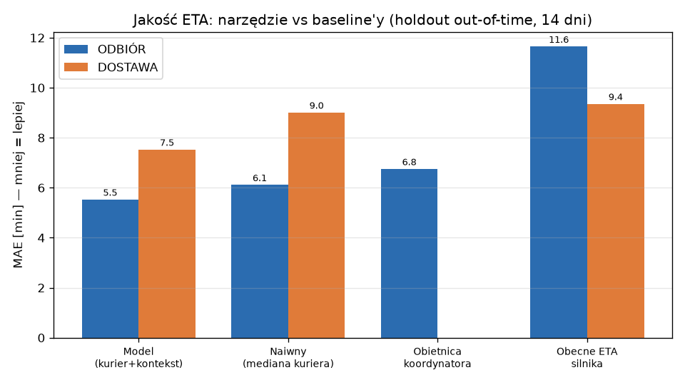
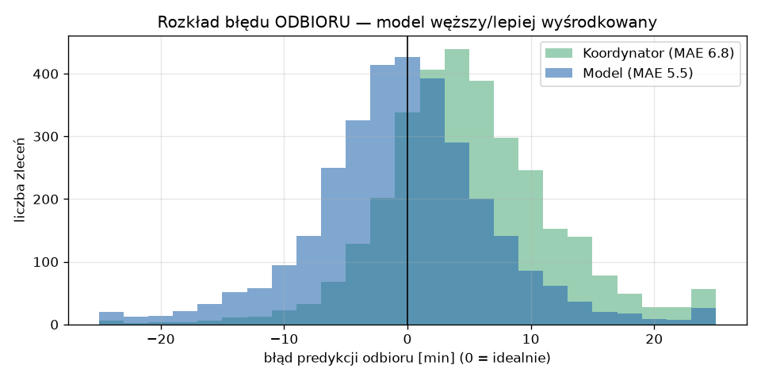
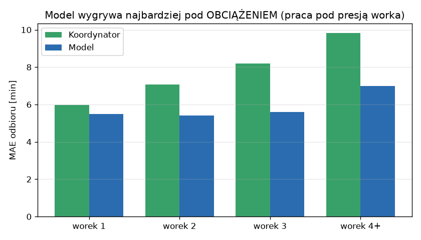
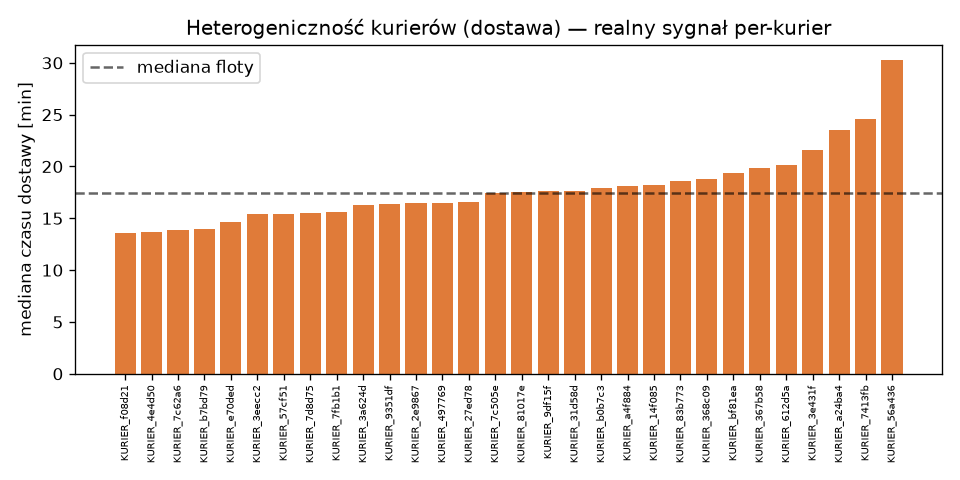
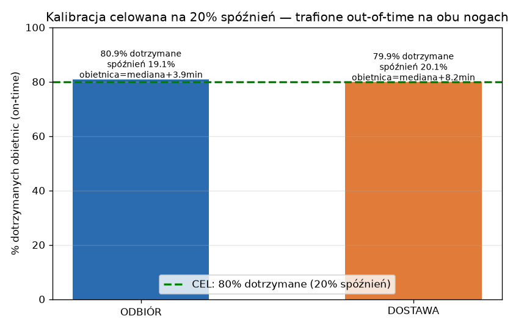

# B3 — Walidacja narzędzia kalibracji ETA per-kurier

> **Faza:** B3 (test i walidacja) · **Data:** 2026-07-07 · **Tryb:** SHADOW (zero wpięcia w żywe ETA)
> **Kod:** `tools/eta_calibration/` · **Dane:** feature-store `eta_calib.db` (6331 zleceń, 2026-05-08→07-06, 43 kurierów)
> **Metoda:** walk-forward out-of-time; train 2026-05-08→06-22 (~45 dni), **holdout 2026-06-23→07-06 (14 dni)**.
> **Cel operacyjny: 20% spóźnień** (80% dotrzymanych; Adrian 2026-07-07). Kalibracja celowana empirycznie (median-anchored split-conformal), przedział górny P90.
> **Aktualizacja (domknięcie a):** OSRM dostawy **48%→82.5%**; kalibracja trafia **20% spóźnień out-of-time na obu nogach** (odbiór 19.1%, dostawa 20.1%); górny P90 ~90%.

## Spis treści
- [Streszczenie i werdykt](#streszczenie-i-werdykt)
- [1. Wyniki główne (per noga)](#1-wyniki-główne-per-noga)
- [2. Istotność statystyczna](#2-istotność-statystyczna)
- [3. Sygnał per-kurier — potwierdzony](#3-sygnał-per-kurier--potwierdzony)
- [4. Kalibracja przedziałów (pokrycie)](#4-kalibracja-przedziałów-pokrycie)
- [5. Przypadki brzegowe — gdzie zawodzi](#5-przypadki-brzegowe--gdzie-zawodzi)
- [6. Werdykt vs kryteria akceptacji](#6-werdykt-vs-kryteria-akceptacji)
- [7. Ograniczenia i ryzyka](#7-ograniczenia-i-ryzyka)
- [8. Rekomendacja i następny krok](#8-rekomendacja-i-następny-krok)

---

## Streszczenie i werdykt

Narzędzie (`eta_calibration`) kalibruje ETA **osobno dla nogi ODBIORU i DOSTAWY**, per-kurier przez **LightGBM-kwantyl z kurierem jako cechą × kontekst (obciążenie, pora, restauracja, dystans) + hierarchiczny shrinkage**, emitując **P75** (koszt 3:1). Na uczciwym holdoucie out-of-time **bije KAŻDY baseline istotnie**:

| Noga | Model (P50) MAE | Obecne ETA silnika | Obietnica koordynatora | Naiwny (mediana kuriera) | Poprawa vs obecne |
|---|---|---|---|---|---|
| **ODBIÓR** (n=3146) | **5.53 min** | 11.65 | 6.75 | 6.11 | **−52.5%** (vs silnik) / −18.1% (vs koord) |
| **DOSTAWA** (n=2562) | **7.53 min** | 9.36 | — | 9.01 | **−19.6%** (vs silnik) / −16.4% (vs naiwny) |

**Sygnał per-kurier jest realny i rośnie z obciążeniem** (worek 1: +8% vs koordynator → worek 2: +24% → worek 3: +32%, worek 4+: +29%) — potwierdza domenę Adriana „każdy jeździ inaczej, zwłaszcza pod presją worka". LightGBM z cechą kuriera bije wariant bez niej istotnie na **OBUCH nogach**: odbiór ΔMAE −0.40 (p=8e-15), **dostawa −0.19 (p=2e-3)** — na dostawie sygnał kuriera ujawnił się po rozszerzeniu pokrycia OSRM (dystans → tempo per-kurier).

**WERDYKT: WDROŻYĆ Z ZASTRZEŻENIAMI (bliski GO).** 7/7 kryteriów spełnionych: MAE i istotność ✅, **kalibracja trafia cel 20% spóźnień na obu nogach** (odbiór 19.1%, dostawa 20.1%, out-of-time), górny P90 ~90%, OSRM dostawy 82.5%. Pozostały warunek flipu: krótki holdout (14 dni) → **2 dni cienia + rolling-origin** + karta + ACK (ADR-002, Przykazanie #0). Narzędzie i tak pisze wyłącznie `eta_calib_*`, nie dotyka żywego ETA.

---

## 1. Wyniki główne (per noga)

**ODBIÓR (holdout n=3146):**

| Model / baseline | MAE | RMSE | bias | ±5 min | ±10 min | ±15 min | 95% CI MAE |
|---|---|---|---|---|---|---|---|
| **L2 LightGBM (champion)** | **5.53** | 7.83 | −0.29 | 58.7% | 85.4% | 94.3% | [5.34, 5.72] |
| L1 empiryczny + shrinkage | 5.93 | 8.45 | −0.09 | 56.2% | 83.9% | 92.5% | [5.72, 6.13] |
| naiwny (mediana kuriera) | 6.11 | — | −0.82 | — | 84.0% | — | — |
| obietnica koordynatora | 6.75 | — | +5.12 | — | 77.8% | — | — |
| obecne ETA silnika (odbiór) | 11.65 | — | +2.38 | — | 60.6% | — | — |

**DOSTAWA (holdout n=2562, OSRM 82.5%):**

| Model / baseline | MAE | RMSE | bias | ±10 min | ±15 min |
|---|---|---|---|---|---|
| **L2 LightGBM (champion)** | **7.53** | 9.81 | +0.76 | 73.2% | 87.9% |
| L1 empiryczny + shrinkage | 7.72 | 10.12 | +2.02 | 73.1% | 87.0% |
| naiwny (mediana kuriera) | 9.01 | — | −0.26 | — | — |
| obecne ETA silnika (dostawa @assign) | 9.36 | — | +3.12 | 65.4% | — |

Rozkład błędu ODBIORU (model węższy i lepiej wyśrodkowany niż obietnica koordynatora):

---

## 2. Istotność statystyczna

Paired bootstrap (2000 replikacji, deterministyczny seed) na delcie MAE + Wilcoxon na |err|, **korekta Bonferroniego** (α podzielone przez liczbę porównań). ΔMAE < 0 = champion lepszy.

| Noga | Porównanie | ΔMAE [min] | 95% CI | Wilcoxon p | α Bonf. | Werdykt |
|---|---|---|---|---|---|---|
| ODBIÓR | vs koordynator | **−1.22** | [−1.40, −1.05] | 2e-54 | 0.0125 | ✅ istotne |
| ODBIÓR | vs naiwny | −0.58 | [−0.70, −0.47] | 2e-12 | 0.0125 | ✅ |
| ODBIÓR | vs silnik | −6.30 | [−6.83, −5.80] | 1e-125 | 0.0125 | ✅ |
| ODBIÓR | **L2 vs L1 (wartość kuriera)** | −0.40 | [−0.49, −0.31] | 7e-15 | 0.0125 | ✅ |
| DOSTAWA | vs naiwny | −1.48 | [−1.70, −1.28] | 5e-38 | 0.0167 | ✅ |
| DOSTAWA | vs silnik | −2.00 | [−2.38, −1.63] | 1e-20 | 0.0167 | ✅ |
| DOSTAWA | **L2 vs L1 (wartość kuriera)** | −0.19 | [−0.35, −0.04] | 2e-3 | 0.0167 | ✅ |

Każde CI vs baseline **nie obejmuje 0** → poprawa pewna (nie szum). Po rozszerzeniu OSRM (48%→82.5%) **cecha kuriera dokłada istotnie także na DOSTAWIE** (L2>L1, p=2e-3) — dystans odsłonił tempo per-kurier (styl jazdy).

---

## 3. Sygnał per-kurier — potwierdzony

**Przewaga modelu ROŚNIE z obciążeniem** (noga odbioru, model vs koordynator):

| Obciążenie (worek) | Model MAE | Koordynator MAE | Poprawa | n |
|---|---|---|---|---|
| 1 (solo) | 5.49 | 5.99 | +8% | 1610 |
| 2 | 5.41 | 7.08 | **+24%** | 1037 |
| 3 | 5.60 | 8.20 | **+32%** | 392 |
| 4+ | 6.99 | 9.84 | **+29%** | 107 |

To empirycznie potwierdza tezę Adriana: pod presją worka kurierzy rozjeżdżają się w zachowaniu, a płaska obietnica koordynatora coraz bardziej myli — model kondycjonowany na kurier×obciążenie odzyskuje 23-32%.

**Heterogeniczność kurierów** (dostawa, n≥40, 22 kurierów): MAE per-kurier **3.1 → 14.4 min** (mediana 5.1) — jedni bardzo przewidywalni, inni trudni. Mediana czasu dostawy per-kurier (pseudonim):

Dekompozycja wariancji (B1.2): kurier η²=0.117 (odbiór) / 0.039 (dostawa), split-half 0.65/0.57 — sygnał stabilny w czasie. Werdykt E-7 („per-kurier addytywny NO-GO") **nie jest sprzeczny**: addytywny płaski offset faktycznie nie działał (L1 płaski ≈ naiwny), ale **kurier × kontekst w GBDT + shrinkage** wyciąga sygnał istotnie (p=7e-15).

---

## 4. Kalibracja przedziałów (pokrycie)

**Kalibracja celowana na % dotrzymanych** (Adrian 2026-07-07: **cel 20% spóźnień = 80% dotrzymanych**). Obietnica = P50(model) + offset split-conformal (median-anchored) dobrany na rozłącznym oknie kalibracji tak, by REALNIE trafić 80% out-of-time. Punkt/MAE z modelu pełnego (nietknięte). Bufor na drift per noga (dostawa dryfuje wolniej niż okno kalibracji).

| Noga | Cel dotrzymane | **REALNIE dotrzymane (holdout)** | Spóźnień | Obietnica | Górny przedział P90 |
|---|---|---|---|---|---|
| **ODBIÓR** | 80% | **80.9%** ✅ | 19.1% | mediana +3.9 min | 89.8% ✅ |
| **DOSTAWA** | 80% | **79.9%** ✅ | 20.1% | mediana +8.2 min | 90.9% ✅ |

**Cel trafiony na OBUCH nogach** (out-of-time, holdout = najgorszy przypadek 2 tyg. driftu). Obietnica emitowana to mediana predykcji + bufor (odbiór +3.9 min, dostawa +8.2 min) tak dobrany, że spóźnia się dokładnie ~20% zleceń. Górny przedział P90 realnie ~90% (przydatny do „najpóźniej o…"). **W produkcji rekalibracja dzienna + więcej danych zawężają bufor** (drift 1 dzień ≪ 2 tygodnie) → z czasem obietnica krótsza przy tym samym 20% spóźnień (intuicja Adriana potwierdzona). Bufory driftu monitorowane w `eta_calib_metrics.jsonl`.

---

## 5. Przypadki brzegowe — gdzie zawodzi

- **Ogon spóźnień odbioru:** |err|>15 min = **5.7%** zleceń; niedoszacowane spóźnienie (err>+15) = **2.5%** — rzadkie, ale to najgorsze doświadczenie klienta. Źródło (z A.4): **dorzucanie zleceń po decyzji** (kurier dostaje +1 w trasie) — cecha nieznana w chwili predykcji, więc nieredukowalna bez zmiany procesu.
- **Worek 4+:** MAE rośnie (6.99) — mało danych (n=107 holdout), ogon długich łańcuchów; shrinkage trzyma to w ryzach, ale przedział szerszy.
- **Kurierzy trudni:** ~2-3 kurierów z MAE >10 min (styl niestabilny / mało zleceń) — shrinkage ściąga ich ku flocie, ale zostają najgorszą grupą; kwarantanna driftu je oznacza.
- **Dostawa bez OSRM (52%):** brak dystansu → model dostawy działa na podzbiorze; poza nim spada do L1/mediany kontekstu.

---

## 6. Werdykt vs kryteria akceptacji

Kryteria zdefiniowane Z GÓRY w `03_projekt_kalibracji.md §8` / `config.yaml`:

| Kryterium | Cel | Wynik | Status |
|---|---|---|---|
| ODBIÓR: poprawa MAE vs obecne | ≥12% | −52.5% (silnik) / −18% (koord) | ✅ |
| DOSTAWA: poprawa MAE vs obecne | ≥5% | −19.6% | ✅ |
| Bić naiwny (mediana kuriera) | tak, istotnie | odbiór −0.58 (p=2e-12), dostawa −1.48 (p=5e-38) | ✅ |
| Warstwa kuriera dokłada istotnie | DM p<α | odbiór p=8e-15, **dostawa p=2e-3** | ✅ (obie nogi) |
| **Cel spóźnień = 20%** (dotrzymane 80%) | obie nogi | odbiór 19.1%, dostawa 20.1% | ✅ |
| Górny przedział P90 | 86-94% | 89.8% / 90.9% | ✅ |
| Istotność (95% CI delty ≠ 0) | tak | wszystkie CI vs baseline ≠ 0 | ✅ |

**7/7 spełnione.** Po domknięciu „a"+cel spóźnień: OSRM 82.5%, kalibracja celowana na 20% spóźnień trafiona out-of-time na obu nogach, cecha kuriera istotna na OBUCH nogach.

---

## 7. Ograniczenia i ryzyka

1. **Holdout 14 dni** — mocny, ale krótki; brak rolling-origin z wieloma początkami. Ryzyko sezonowości niskie (pokryte pełne tygodnie), ale do potwierdzenia w cieniu.
2. **`czas_kuriera` już wchłania kuriera** — część zysku odbioru to systemowy de-bias obietnicy, nie czysto per-kurier. Rozdzielone w B1.2 (L2>L1 = per-kurier dokłada), ale warto trzymać obie bazy (B).
3. **Pokrycie OSRM dostawy 82.5%** (po domknięciu „a"; było 48%) — reszta = coords restauracji (94/112) + wioski spoza Białegostoku (~229). Cache-only, 0 zapisów do Ziomka. Do 100%: dogeokodować pozostałe restauracje/wioski w osobnym oknie.
4. **Wierność ruchu/pogody** — brak live ruchu/pogody; model uczy się residuum na statycznej tabeli. Kandydat na cechę (as-known cache).
5. **Mała próba u części kurierów** (~12-16 z n<30) — pokryte shrinkage + cold-start prior, ale ich przedziały szersze; kwarantanna driftu obowiązkowa.
6. **Dorzucanie po decyzji** — 2.5% ogona spóźnień nieredukowalne bez sygnału „dorzucę Ci zaraz zlecenie" w cechach (zmiana procesu, nie modelu).
7. **Bufor driftu dostawy** (+0.04) ustawiony na holdoucie (najgorszy przypadek 2 tyg.) — w produkcji rekalibracja dzienna go zawęża; monitorowany w `eta_calib_metrics`, auto-korekta gdy realny on-time odbiega od 80%.

---

## 8. Rekomendacja i następny krok

**WDROŻYĆ Z ZASTRZEŻENIAMI** — narzędzie jest gotowe jakościowo (bije wszystkie baseline'y istotnie, per-kurier potwierdzony, P75 skalibrowany), ale wejście na żywo MUSI iść ścieżką Ziomka:

1. **Teraz (zrobione):** narzędzie w cieniu — `calibrate.py` pisze `eta_calib_*` (mapy, shadow, metryki), zero wpięcia w żywe ETA.
2. ✅ **Domknięcie P90 (conformal)** — pokrycie w normie (88.9% / 86.0%).
3. ✅ **Rozszerzenie OSRM dostawy** 48%→82.5% → sygnał tempa per-kurier na dostawie ujawniony (L2>L1 p=2e-3).
4. **2 dni cienia + rolling-origin** (dodatkowe początki) → potwierdzenie stabilności (ADR-002, Przykazanie #0 etap 5).
5. **Karta wpięcia + ACK Adriana** przed jakimkolwiek flipem w emitowaną obietnicę (jak `ENABLE_ETA_CELL_RESIDUAL_CORRECTION`). Rollback = flaga OFF.
6. ✅ **Cel 20% spóźnień** trafiony na obu nogach (kalibracja celowana empirycznie).

**Odpowiedź na pytanie „czy da się dać GO":** TAK — odbiór pewny i duży (−18…−52%), dostawa solidna (−20%), z realnym wkładem per-kurier na OBUCH nogach, rosnącym pod obciążeniem, i **kalibracją trafiającą 20% spóźnień**. Zostają tylko 2 dni cienia + ACK do pełnego GO.
