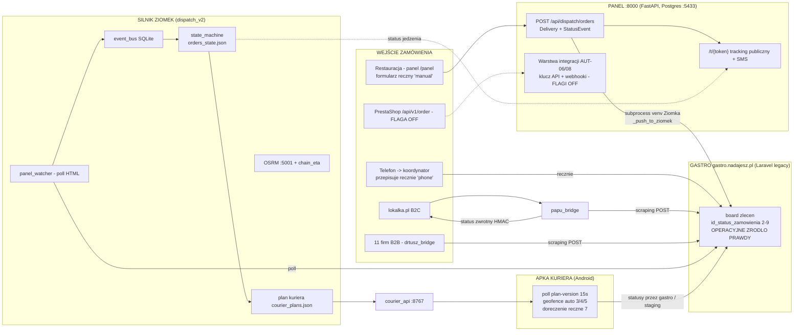

# 00 — STAN OBECNY: gotowość integracyjna systemu nadajesz.pl

> Wielki Audyt Integracji — FAZA 0 (rekonesans). Data: 2026-07-05. Tryb: READ-ONLY.
> Źródła: 4 równoległe audyty kodu (API / domena / panele / infrastruktura). Wszystkie fakty z tego pliku pochodzą z kodu na żywo — status `[ZWERYFIKOWANE-KOD]`.

## TL;DR

1. **Fundament API integratorskiego JUŻ ISTNIEJE, ale jest wyłączony flagami.** W panelu (`nadajesz_clone/panel/backend`) zbudowana jest kompletna warstwa: klucz API per połączenie (`IntegrationConnection`, SHA-256, scope tenant+lokal), inbound `POST /api/public/orders` z idempotencją i `needs_review`, wycena `POST /api/public/quote`, webhooki wychodzące z HMAC i logiem doręczeń (AUT-08), legacy kontrakt PrestaShop `POST /api/v1/order` zgodny 1:1 z nadajesz.pl. **Wszystko za flagami `AUT06_POS_INTEGRATION` / `AUT08_OUTBOUND_API` = `False` (`app/core/flags.py`) → domyślnie 404.**
2. **Ścieżka krytyczna zlecenia idzie przez legacy.** Restauracja → panel :8000 → **subprocess do venv silnika → scraping HTML panelu gastro (Laravel, cookie+CSRF)** → silnik Ziomek polluje gastro. Gastro nie ma REST API i jest operacyjnym źródłem prawdy statusu jedzenia.
3. **Zero pushu na zewnątrz.** Brak workera webhooków (model `emit_event` → log `retrying` istnieje, HTTP push nie). Wszystkie kanały wewnętrzne to polling (panel_watcher, apka co 15 s, board co 15 s).
4. **Trzy rozjechane źródła prawdy stanu:** gastro (`id_status_zamowienia` 2–9, operacyjne) ↔ silnik (`orders_state.json`) ↔ panel (Postgres `Delivery`+`StatusEvent`; dla jedzenia panel sam nie ufa własnej kolumnie i sięga do silnika).
5. Wejście zamówienia = **ręczne przepisywanie** (formularz restauracji `source_channel="manual"`, telefoniczne `phone` przepisywane przez koordynatora do gastro, konfiguracja mostów w kodzie).

---

## 1. Mapa API (per serwis)

### 1a. Panel backend — FastAPI :8000 (bind 127.0.0.1; nginx: `gps.nadajesz.pl/admin/api/`, `/panel/api/`, `bialystok.nadajesz.pl/papi/` → `:8000/api/`)

Auth-światy: **A** = JWT operatora/restauracji (HS256, claims `sub/tid/roles/locs`, RBAC `require_roles`; `app/core/deps.py:52`) · **B** = JWT klienta paczkowego (claim `acc`, cookie `panel_session`; flaga `CLIENT_PORTAL`; `app/core/client_auth.py:63`) · **C** = klucz API (`X-Api-Key`/`Bearer`/`token_api`; `IntegrationConnection.secret_hash`; `app/core/api_auth.py`) · **PUB** = publiczny (token opaque lub flaga).

| Endpoint | Metoda | Auth | Opis | Konsument |
|---|---|---|---|---|
| `/api/auth/login`, `/me`, `/change-password`, `/change-pin` | POST/GET | A | logowanie, konto | FE oba panele |
| **`/api/dispatch/orders`** | POST | A (owner/manager/staff) | **złożenie zlecenia przez restaurację**; `idempotency_key`→409; flaga OPS02 (`dispatch.py:225`) | FE panel restauracji |
| `/api/dispatch/estimate` | POST | A | „Sprawdzam" — propozycja silnika w cieniu (`dispatch.py:317`) | FE restauracja |
| `/api/dispatch/{fleet-eta,queue,emergency-mode,offline-queue,bag-config,address-check,streets,towns}` | GET/PUT | A | nagłówek floty, kolejka, tryb awaryjny, autouzupełnianie adresów | FE restauracja |
| `/api/dispatch/orders/{id}/manual-assign` | POST | A (owner/manager) | ręczny przydział (`dispatch.py:704`) | FE |
| `/api/deliveries` + `/{id}`, `/status`, `/cancel`, `/restaurant-edit`, `/restaurant-board`, `/pickup-delays`, `/kpi`, `/map`, `/live-active` | GET/POST/PATCH | A | board restauracji, statusy, KPI | FE restauracja |
| `/api/coordinator/{fleet,orders,alerts,health,history,route-geometry,restaurants,…}` | GET | A (operator) | konsola koordynatora — monitor floty | FE `/admin` |
| `/api/coordinator/{assign,cancel,route,edit,create,quote,courier-block,courier-message,refresh-time}` | POST | A (operator) | akcje koordynatora (WRITE do gastro/silnika; `coordinator.py:182`) | FE `/admin` |
| `/api/coordinator/ziomek/control`, `/auto-assign`; `/api/ziomek/{feed,couriers}`; `/api/shadow-monitor/*` | GET/POST | A (operator, część PIN) | autonomia + feed propozycji silnika | FE `/admin` |
| **`/api/tracking/t/{token}`** + `/rating`; `/api/public/tracking/{token}` | GET/POST | **PUB (token)** | śledzenie dla klienta końcowego + ocena (`tracking.py:46`, `public_tracking.py`) | przeglądarka klienta (link z SMS) |
| `/api/customer-sms/*`, `/api/alerts/*`, `/api/notify-feed/*`, `/api/eta-eval/summary` | GET/POST/PUT | A | SMS do klienta, alerty opóźnień, feed powiadomień | FE |
| `/api/drivers/*` (~16), `/api/vehicles/*` (~25), `/api/fleet/*`, `/api/schedule/builder/*`, `/api/sys-health` | GET/POST | A (admin/operator) | flota, grafik GRF-02, health | FE `/admin` |
| `/api/finance/*` (~25), `/api/analytics/*`, `/api/cost-invoices/*`, `/api/invoicing/*`, `/api/documents/*` | GET/POST | A (finance/admin) | rozliczenia, KSeF, wFirma | FE `/admin` |
| `/api/org/*`, `/api/meta/{flags,features}`, `/api/clients/*`, `/api/restaurant-accounts/*`, `/api/customers/*` (RODO) | GET/POST | A | organizacja, konta, RODO erase/opt-out | FE `/admin` |

### 1b. Powierzchnia INTEGRATORSKA (paczkowa) — zbudowana, **flagi OFF → 404**

| Endpoint | Metoda | Auth | Opis | Konsument (docelowy) |
|---|---|---|---|---|
| **`/api/public/quote`** | POST | PUB (flaga AUT06) | wycena przed zleceniem (`public_quote.py:71`) | strona/integrator |
| **`/api/public/orders`** | POST | **C + nagłówek `Idempotency-Key`** | złożenie zlecenia przez integratora → `ingest_inbound_order` → kurs OPS-02 (`public_orders.py:211`) | POS/sklep/integrator |
| **`/api/v1/order`** | POST (form) | C (`token_api`) | **legacy kontrakt PrestaShop 1:1 z nadajesz.pl**; zwraca `{status, order_number, tracking, url_tracking}` (`legacy_order.py:134`) | moduł PrestaShop |
| `/api/integrations/connections` + `/{id}/inbound`, `/inbound/{id}/confirm|reject` | GET/POST | A (owner/manager) | zarządzanie połączeniami API, kolejka `needs_review` | panel |
| **`/api/integrations/webhooks`** + `/rotate-secret`, `/emit/{type}`, `/{id}/deliveries` | GET/POST | A + entitlement `outbound_api` | **webhooki WYCHODZĄCE** (AUT-08): subskrypcje zdarzeń, HMAC `client_secret`, stabilny `event_id` = idempotencja u odbiorcy (`integrations.py:210`) | system partnera |
| `/api/integrations/{rules,kitchen/devices,fire-rule,fire}` | GET/POST/PUT | A + entitlement `kds` | auto-zamawianie + KDS (AUT-07) | KDS |
| `/api/public/payments/{init,p24/notify,status}`, `/api/public/{geocode,reverse}` | POST/GET | PUB | płatności P24, geokoder | strona paczkowa |
| `/api/panel-auth/*`, `/api/panel-orders`, `/api/panel-addresses|invoices|cod/*` | GET/POST | B | samoobsługowy panel klienta paczkowego (CLIENT_PORTAL) | klient B2B |

### 1c. Courier API — :8767 (apka kuriera; nginx `gps.nadajesz.pl/api/`)

| Endpoint | Metoda | Auth | Opis | Konsument |
|---|---|---|---|---|
| `/api/ping`, `/api/app/version`, `/api/couriers` | GET | brak | health, wersja, lista do logowania | apka |
| `/api/auth/select`, `/api/auth/logout` | POST | PIN → token opaque (lockout `pin_attempts`) | logowanie kuriera (`main.py:225`) | apka |
| `/api/gps/batch` | POST | sesja | wsad pozycji GPS | apka |
| **`/api/courier/orders`**, `/plan-version`, `/route-geometry`, `/stream` (SSE) | GET | sesja | **trasa kuriera z planu silnika**; poll wersji co 15 s (`main.py:398`) | apka |
| `/api/courier/orders/{id}/{status,arrival,payment-method}` | POST | sesja | status (staging!), geofence 5b, płatność | apka |
| `/api/courier/{earnings/history,schedule,availability,shift-offers,vehicle-issues}` | GET/POST | sesja | zarobki, grafik, dyspozycje, usterki | apka |
| `/api/eta/orders` | GET | `X-Eta-Token` (env) | ETA server-to-server | narzędzia wewn. |

### 1d. Gastro legacy (`gastro.nadajesz.pl`, Laravel `admin2017`) — **BRAK REST API**; konsumowany jako „API" przez scraping

| „Endpoint" | Metoda | Auth | Opis | Konsument |
|---|---|---|---|---|
| `POST /admin2017/new/orders/add-zamowienie-zadmina` | POST (form) | sesja cookie+CSRF | utworzenie zlecenia — ten sam formularz dla człowieka i mostów | koordynator, most Papu, most DrTusz |
| `POST /admin2017/new/orders/edit-zamowienie` | POST (form) | sesja cookie+CSRF | zmiana statusu/kuriera/czasów (`panel_client.py`) | silnik (gastro_assign/edit), mosty |
| board HTML (lista zleceń) | GET | sesja | **jedyny ingest zleceń do silnika** — poll + parsowanie HTML (`panel_watcher.py`) | silnik Ziomek |

### 1e. Mosty (istniejące integracje) 

| Most | Kierunek | Mechanizm | Mapowanie | Status zwrotny | Monitoring |
|---|---|---|---|---|---|
| `papu_dispatch_bridge` (lokalka.pl) | in+out | HMAC `GET /api/v1/internal/orders/pending-dispatch` → wstrzyknięcie do gastro (marker `#PAPU:<uuid>` w uwagach) | `restaurant_map.json` (ręczny) | **pełny**: kurier+czas+ETA → `POST /api/v1/internal/orders/{uuid}/dispatch` (HMAC) | OnFailure→Telegram + log |
| `drtusz_bridge` (11 firm B2B) | in (+mikro-out) | scraping źródłowego panelu → `add-zamowienie` w gastro; retry 3× | `COMPANIES` w **kodzie** (cid→rid, catch-all rid=161, `verbose_uwagi`, `pickup_rules`) | częściowy (`id_kurier` w źródle); **brak callbacku do systemu firmy** | OnFailure→TG + alerty aplikacyjne |
| `epaka_fetcher` | in (dane) | CSV cron 06:00 (+ OCR captchy) → rollup rozliczeniowy | per firma | n/d | timer + OnFailure |
| legacy `/api/v1/order` (PrestaShop) | in | klucz API → `ingest_inbound_order` | `IntegrationConnection` | pełny (JSON + tracking URL) | **flaga OFF** |
| apka kuriera | in+out | PIN→token; statusy → gastro (via silnik) | cid | statusy 3/4/5/6/7 | courier-panel-sync |

---

## 2. Diagram cyklu życia zlecenia (tor jedzenia — kanon silnika)

```mermaid
stateDiagram-v2
    [*] --> planned : NEW_ORDER (panel_watcher poll gastro id_status=2)
    planned --> assigned : COURIER_ASSIGNED (silnik / koordynator; gastro 3-4)
    assigned --> planned : COURIER_REJECTED_PROPOSAL
    assigned --> assigned : przerzut = kolejny COURIER_ASSIGNED (zmiana courier_id)
    assigned --> picked_up : COURIER_PICKED_UP (gastro 5; picked_up_at, SLA +35 min)
    assigned --> returned_to_pool : ORDER_RETURNED_TO_POOL
    picked_up --> returned_to_pool : ORDER_RETURNED_TO_POOL
    returned_to_pool --> assigned : ponowny przydział
    picked_up --> delivered : COURIER_DELIVERED (gastro 7; delivered_at, final_location)
    delivered --> picked_up : resurrect_order (ręczne cofnięcie w gastro)
    delivered --> [*]
    note right of planned
        Czasówka: id_kurier=26 (wirtualny koordynator),
        hold >=60 min; czas_kuriera nietykalny (frozen ETA)
    end note
    note right of delivered
        gastro 8 (nieodebrano) / 9 (anulowane):
        IGNOROWANE przez panel_watcher -
        brak czystej sciezki anulacji w torze jedzenia.
        cancelled istnieje w ORDER_STATUSES, nieuzywany eventowo.
    end note
```

Równoległy **tor paczkowy** (panel, `services/deliveries.py` `ALLOWED_TRANSITIONS` — jedyna twardo walidowana maszyna stanów): `new → queued → assigned → pickup_started → picked_up → en_route → delivered`, z gałęziami `cancelled` (do `pickup_started`), `failed → needs_review → (new|queued|assigned|cancelled)`. Naruszenie przejścia = 409 `TransitionError`. **Tor jedzenia takiej walidacji nie ma.**

## 3. Diagram architektury wysokopoziomowej



## 4. Trzy światy stanu (kluczowy problem architektoniczny)

| Świat | Nośnik | Rola | Słabość |
|---|---|---|---|
| Gastro (Laravel) | `id_status_zamowienia` 2–9 | operacyjne źródło prawdy jedzenia (tu klika koordynator/kurier) | brak API, scraping HTML, brak walidacji przejść |
| Silnik Ziomek | `orders_state.json` + `event_bus` (SQLite) | kanon dispatchu = lustro gastro + decyzje | plik na dysku, purge 48 h, niewystawiony na zewnątrz |
| Panel | Postgres `Delivery` + `StatusEvent` | prawda toru paczkowego i UI | dla jedzenia maruder — sam sięga do `orders_state.json` (`_real_gastro_status()`) |

Konsekwencja dla integracji: **żeby wysłać partnerowi webhook „kurier odebrał", trzeba dziś nasłuchiwać scrapingu legacy panelu.** Warstwa emisji zewnętrznej musi stanąć na JEDNYM kanonie (docelowo: silnik/panel jako źródło, gastro jako jedno z ujść).

## 5. Punkty ręcznego przepisywania danych (z audytu paneli)

1. Restauracja → panel: pełne zamówienie ręcznie (`NewDeliveryForm.tsx`, `source_channel="manual"` — telefon, adres, COD, torba, uwagi, czas).
2. Koordynator → gastro: zamówienia telefoniczne przepisywane ręcznie (`add-zamowienie-zadmina`, `source_channel="phone"`).
3. Adres odbioru zaszyty w free-text `uwagi` → parsowany heurystycznie (`uwagi_address_parser.py:220`).
4. Konfiguracja 11 firm w **kodzie** (`drtusz_bridge/config.py`: cid↔rid, catch-all 161, `verbose_uwagi`, `pickup_rules`) — nowa firma = edycja kodu + deploy.
5. `id_kurier=94` propagowany do źródła; wyjątki ręcznie.
6. `papu_dispatch_bridge/restaurant_map.json` — mapowanie UUID→rid ręcznie per onboarding.
7. Onboarding restauracji: operator ręcznie tworzy konto (`RestaurantAccounts.tsx`), poświadczenia przekazywane poza systemem.
8. Epaka: ręczny re-seed sesji przy padnięciu OCR.
9. Kurier: doręczenie (7) zawsze ręczne; brak PoD (foto/podpis).
10. Alerty Telegram „obsłuż ręcznie" jako standardowy fallback wszystkich mostów.

## 6. CHECKLIST GOTOWOŚCI INTEGRACYJNEJ

| # | Zdolność | Ocena | Uzasadnienie (kod) |
|---|---|---|---|
| 1 | Publiczne API | **CZĘŚCIOWO** | powierzchnia istnieje (`/api/public/orders`, `/api/v1/order`), ale za flagami `AUT06/AUT08=False` → 404; brak API dla toru jedzenia z zewnątrz |
| 2 | Publiczna dokumentacja API | **NIE** | Swagger/OpenAPI generowany przez FastAPI, ale nieosiągalny z zewnątrz (nginx proxuje tylko `/api/`); zero docs partnerskich |
| 3 | Klucze API per restauracja | **CZĘŚCIOWO** | model gotowy (`IntegrationConnection`: hash SHA-256, scope tenant+lokal, `kind`, rotacja dla webhooków) — nieaktywny, zero self-service |
| 4 | Sandbox | **NIE** | brak test-tenanta i trybu sandbox; staging silnika i replay harness to narzędzia wewnętrzne, nie środowisko dla integratora |
| 5 | Webhooki statusów wychodzące | **CZĘŚCIOWO** | pełny model AUT-08 (subskrypcje, HMAC, `event_id`, `OutboundDeliveryLog` retrying/delivered) — **brak workera HTTP push**; flaga OFF |
| 6 | Webhook receiver (inbound) | **CZĘŚCIOWO** | `ingest_inbound_order`: idempotencja UNIQUE `(connection, external_order_id)`, braki→`needs_review` — dojrzały; brak weryfikacji HMAC inbound per źródło; flaga OFF |
| 7 | Endpoint wyceny (quote) | **CZĘŚCIOWO** | `POST /api/public/quote` istnieje (flaga OFF); rozłączny z order (brak „zamów po quote_id"); `estimate` tylko dla zalogowanej restauracji |
| 8 | Idempotencja żądań | **CZĘŚCIOWO** | wyspowa: `idempotency_key` (dispatch), nagłówek `Idempotency-Key` (public), heurystyka (legacy), `event_id` (webhooki) — brak jednej konwencji |
| 9 | Wersjonowanie API | **NIE** | brak strategii; jedyne `/api/v1` to legacy PrestaShop |
| 10 | Link śledzenia dla klienta końcowego | **TAK** | `/t/{token}` + `/sledz` (token opaque, minimum PII, pozycja kuriera, timeline, ocena) + SMS z linkiem przy odbiorze |
| 11 | Potwierdzenie doręczenia (POD) | **NIE** | tylko `delivered_at` (ręczny suwak); „foto/podpis = Faza 2, brak kolumn" (`panel_orders.py:164`); geofence 5b measurement-only |
| 12 | Proces onboardingu integratora | **NIE** | zero self-service; każda integracja = ręczny JSON/kod + deploy; onboarding restauracji ręczny, rozjechany na 2 światy |
| 13 | Monitoring i logi per integracja | **CZĘŚCIOWO** | OnFailure→Telegram per usługa, logi i state-pliki mostów, alerty aplikacyjne; brak per-integrator dashboardu/health i alertów z `OutboundDeliveryLog`/`InboundOrderEvent` |

**Bilans: 1× TAK, 7× CZĘŚCIOWO, 5× NIE.**

## 7. Aktywa do wykorzystania (nie budujemy od zera)

- Warstwa AUT-06/07/08 + legacy PrestaShop = ~60% fundamentu „klucz API + webhook" już w kodzie, dobrej jakości (idempotencja, `needs_review`, HMAC, stałoczasowa weryfikacja sekretu).
- Most Papu = działający wzorzec **pełnej pętli** integracji (inbound HMAC + status zwrotny z kurierem/ETA) — do skopiowania jako kontrakt partnerski.
- Tracking `/t/{token}` z min. PII + SMS = gotowy „tracking link" na poziomie liderów.
- `StatusEvent` (append-only, idempotentny) = gotowy strumień źródłowy dla webhooków.
- Maszyna stanów paczkowa (`ALLOWED_TRANSITIONS`) = wzorzec do przeniesienia na tor jedzenia.
- Geofence apki (5b) = przyszły sygnał `arrived_at_dropoff` dla partnerów.

## 8. Główne blokery (zapowiedź FAZY 3 — analiza luk)

1. Brak workera doręczającego webhooki (HTTP push + backoff).
2. Ścieżka krytyczna przez scraping legacy gastro (subprocess + HTML/CSRF) zamiast czystego API silnika.
3. Trzy źródła prawdy stanu; brak wymuszanej maszyny stanów i czystej anulacji w torze jedzenia.
4. Flagi OFF + brak wersjonowania, wspólnego modelu błędów, rate-limitu na kluczu API, powiązania quote→order.
5. Zero sandboxa, publicznych docs, self-service onboardingu, per-integrator monitoringu.
6. Sieć: porty 8766/8767/5001 na 0.0.0.0 chronione wyłącznie Hetzner Cloud FW — przed wystawieniem API dodać host-firewall/bind lokalny.
7. POD nie istnieje (spory o doręczenie), COD tylko ręcznie w apce.

---

*Pliki-kotwice: `panel/backend/app/core/api_auth.py` · `app/services/integrations.py` · `app/api/{public_orders,public_quote,legacy_order,integrations,dispatch}.py` · `app/core/flags.py` · `app/services/deliveries.py` · `app/api/public_tracking.py` · `dispatch_v2/{state_machine,event_bus,panel_watcher,panel_client}.py` · `courier_api/{main,auth,status_store}.py` · `scripts/{papu_dispatch_bridge,drtusz_bridge}/` · `/etc/nginx/sites-available/*`.*
