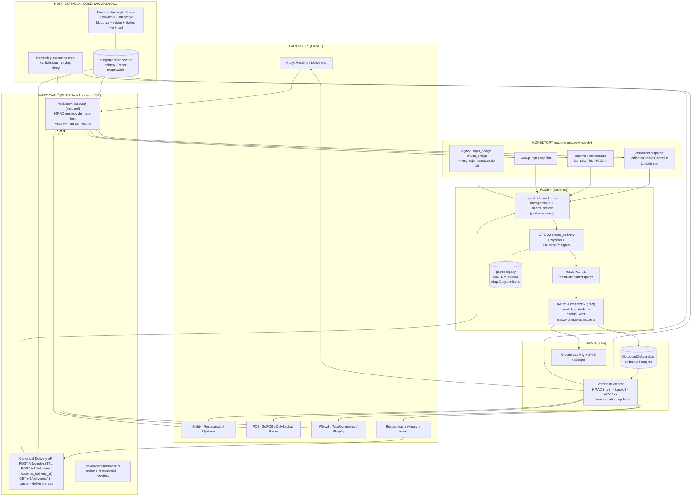

# 04 — ARCHITEKTURA DOCELOWA modułu integracji

> Wielki Audyt Integracji — FAZA 3B. Data: 2026-07-05.
> Zasada nadrzędna: **każda nowa integracja to osobny konektor dodawany bez zmian w rdzeniu systemu.**
> Dokument projektowy (READ-ONLY sesja — zero zmian w kodzie); implementacja wg protokołu zmian Ziomka.

## 1. Ocena obecnej architektury: czy umożliwia model konektorowy?

**Werdykt: w 70% TAK — wzorzec konektorowy już istnieje organicznie, trzeba go sformalizować, nie wymyślać.**

Co już działa jak konektory:
- **Mosty = osobne procesy** (`papu_dispatch_bridge`, `drtusz_bridge` jako osobne timery systemd z własnym stanem, logiem i alertem OnFailure→Telegram) — dokładnie „konektor bez zmian w rdzeniu". Słabość: konfiguracja w kodzie (`COMPANIES`, `restaurant_map.json`) i wstrzykiwanie przez scraping gastro.
- **Wspólny punkt ingest** — `svc.ingest_inbound_order` (`app/services/integrations.py`): idempotencja `(connection, external_order_id)`, braki→`needs_review`, reużycie OPS-02 `create_delivery`. To już jest „port wejściowy" architektury heksagonalnej.
- **Model połączeń** — `IntegrationConnection` (tenant+lokal, `kind∈{pos,kds,webhook}`, `provider`, sekret hash, enabled) = gotowy rejestr konektorów.
- **Strumień zdarzeń** — `StatusEvent` (append-only, idempotentny) + `OutboundDeliveryLog` = gotowy outbox.
- **Szyna silnika** — `event_bus` (zamknięty katalog EVENT_TYPES) = wewnętrzne źródło zdarzeń domenowych.

Co łamie zasadę konektorową (do wydzielenia):
1. **Trzy źródła prawdy stanu** — konektor musiałby dziś nasłuchiwać scrapingu gastro; kanon publiczny musi być JEDEN (StatusEvent zasilany z silnika w czasie rzeczywistym — luka L4).
2. **Panel→silnik przez subprocess** (`app/integrations/ziomek/adapter.py` woła venv Ziomka CLI) — działa, ale nie jest kontraktem; docelowo wewnętrzne API/kolejka.
3. **Mapowania w kodzie** (cid↔rid, UUID↔rid) — do DB (`IntegrationConnection` + tabela mapowań zleceń).
4. **Brak warstwy publicznej** (quotes/deliveries/webhooks-out) — luki L1–L3.

## 2. Wybór wzorca: **Ports & Adapters (heksagonalna) + konektory jako OSOBNE PROCESY, nie pluginy in-process**

Uzasadnienie wyboru (vs alternatywy):
- **Plugin in-process (Strategy/plugin registry w jednym serwisie):** odrzucone jako model główny — konektor z błędem/wolnym HTTP blokowałby rdzeń; deploy konektora wymuszałby restart rdzenia; sprzeczne z realiami repo współdzielonego przez sesje. (Wewnątrz Webhook Gateway dopuszczamy lekkie strategie per-provider do parsowania payloadu.)
- **Osobny proces per konektor (jak dziś mosty):** zgodne z tym, co już działa (systemd timery + OnFailure), niezależny deploy i rollback per integracja, izolacja awarii. Koszt: więcej jednostek systemd — akceptowalny (jest już ~60 timerów i wzorzec `dispatch-onfailure-alert@`).
- **Broker (Redis/Rabbit):** NIE na tę skalę. Outbox w Postgres (`OutboundDeliveryLog` + `FOR UPDATE SKIP LOCKED` — wzorzec już sprawdzony w cronach Papu) + timery systemd wystarczą do setek restauracji. Decyzję o brokerze odłożyć do >10 zleceń/s.

**Kontrakt konektora** (formalizacja — interfejs, który każdy konektor implementuje):
- **Inbound:** `normalize(payload_provider) → CanonicalDeliveryRequest` (wołane przez Webhook Gateway lub proces-poller konektora) → wspólny `ingest_inbound_order`.
- **Outbound:** subskrypcja w outbox (`WebhookSubscription` per connection) + opcjonalny `translate(canonical_event) → payload_provider` dla partnerów z własnym formatem (Deliverect Update, Restimo, Papu-HMAC).
- **Health:** `health() → {ok, last_success, queue_depth}` raportowane do rejestru połączeń.
- Konfiguracja: wyłącznie w DB (`IntegrationConnection` + `connection_settings` szyfrowane), NIGDY w kodzie.

## 3. Diagram architektury docelowej

## 4. Komponenty — projekt i uzasadnienie

### 4.1 Canonical Delivery API (`/v1`)
Kontrakt = „Standard branżowy" z `02-BENCHMARK.md` (MUST 1–10): quotes z TTL, deliveries z `external_delivery_id`, cancel z `reason`+`cancellable`, delivery-areas, COD, tracking_url. **Implementacyjnie cienka warstwa nad istniejącym OPS-02/`ingest_inbound_order`** — żadnego drugiego silnika zleceń. Wersjonowanie w ścieżce (`/v1`); zmiany łamiące = `/v2` + okres podwójnej emisji webhooków (lekcja Stuart v2→v3).

### 4.2 Webhook Gateway (inbound)
Jeden serwis przyjmujący zdarzenia OD partnerów (Deliverect Validate/Create/Cancel, przyszłe huby): weryfikacja podpisu **per provider** (strategie: HMAC-nagłówek, sekret w URL, Basic — partnerzy się różnią), rate-limit per connection, walidacja payloadu, przekazanie do `normalize()` konektora → `ingest_inbound_order`. Odpowiedzi synchroniczne tam, gdzie kontrakt partnera tego wymaga (Deliverect Validate musi dostać `canDeliver`+cenę+ETA w odpowiedzi — spinamy z silnikowym quote przez ten sam moduł co `/v1/quotes`).

### 4.3 Kanon zdarzeń i moduł mapowania (serce — luka L4)
- **Jedno źródło emisji publicznej: `StatusEvent`** (panel, Postgres). Zasilanie: most z `event_bus` silnika w czasie rzeczywistym (nie polling paneli po plikach). Tor jedzenia dostaje maszynę przejść (rozszerzenie `ALLOWED_TRANSITIONS`), jawną anulację i mapowanie gastro 8/9 → `FAILED`/`CANCELLED`. Zdarzenie cofające (resurrect) emitowane jawnie jako korekta — partner dostaje `status_corrected`, nie ciche cofnięcie.
- **Mapowanie identyfikatorów** — tabela `integration_order_map`: `connection_id + external_delivery_id` (partnera) ↔ `delivery_id` (panel) ↔ `dispatch_external_zid` (gastro/silnik) ↔ `quote_id`. Zastępuje `restaurant_map.json` i mapowania w `COMPANIES` (te przechodzą do `IntegrationConnection.location_id` + `connection_settings`). Kanoniczny model zamówienia = istniejący `Delivery` + pola gastro (pickup_at/torba) — bez nowej encji.
- **Dwa etapy względem gastro (świadoma sekwencja):** etap 1 (IR v1) — gastro pozostaje w ścieżce (create → push do gastro → silnik polluje), kanon publiczny czytany z silnika/StatusEvent; etap 2 (program L21) — ingest bezpośrednio do silnika (`NEW_ORDER` w `event_bus`), gastro staje się ujściem-lustrem dla koordynatorów. **API publiczne projektujemy tak, by etap 2 nie zmienił kontraktu** (partner nie widzi różnicy).

### 4.4 Outbound: outbox + Webhook Worker (luka L1)
- Wzorzec **transactional outbox**: zapis `StatusEvent` → wpis w `OutboundDeliveryLog` (już idempotentny per `(subscription, event_id)`) → worker wysyła HTTP.
- Worker: `FOR UPDATE SKIP LOCKED`, exponential backoff (5→25→125→625 s, cap 30 min — sprawdzone wartości z notifications-workera Papu), max prób konfigurowalny, po wyczerpaniu → status `failed` + alert + widoczne w panelu monitoringu; ACK=2xx.
- Podpis: `Signature: t=<unix_ts>,v1=HMAC-SHA256(secret, "<ts>.<body>")` (wzorzec Stripe/Deligoo — ochrona replay; prostszy niż JWT Wolta, silniejszy niż Basic DoorDasha). Sekret per subskrypcja, rotacja istniejącym endpointem `rotate-secret`.
- Katalog zdarzeń v1: 10 statusów kanonu + `delivery.eta_updated` + opcjonalny strumień `courier.location_updated` (throttling ~20–30 s, tylko dla subskrybentów z entitlementem — koszt).
- Tryby dostarczania per partner: standardowy webhook (JSON kanoniczny) lub `translate()` konektora (format partnera, np. Deliverect Update).

### 4.5 Retry / fallback / awaria zewnętrznego API
- **Inbound (partner→my):** idempotencja `external_delivery_id` czyni retry partnera bezpiecznym; nasza niedostępność → partner ponawia (standard branżowy); wskazane 202+kolejka przy przeciążeniu.
- **Outbound (my→partner):** backoff jak wyżej; po `failed` partner ma polling fallback `GET /v1/deliveries/{id}` (wzorzec DoorDash).
- **Awaria gastro (etap 1):** istniejące mechanizmy (retry mostów 3×, alerty, tryb awaryjny OPS-10) + jawny status `needs_review` zamiast cichej utraty; komunikat do partnera przez webhook `delivery.delayed`/`needs_review`.
- **Circuit breaker per connection:** po N kolejnych porażkach wysyłki → pauza subskrypcji + alert (nie zapychamy workera martwym endpointem).

### 4.6 Monitoring, alerting, debug dla supportu (luka L19)
- Reużycie wzorca `dispatch-onfailure-alert@<service>` dla procesów konektorów.
- Widok panelu (rozszerzenie SYS-01): per connection — liczniki inbound (przyjęte/odrzucone/needs_review), outbound (delivered/retrying/failed), czas ostatniego sukcesu, podgląd ostatnich N payloadów (z maskowaniem PII) do debugowania „czemu zlecenie nie weszło".
- Correlation-id w każdej odpowiedzi API i logu (nowy nagłówek `X-Request-Id`).

### 4.7 Panel konfiguracji integracji dla restauracji (luka L12)
W panelu restauracji (Ustawienia→Integracje — zakładka już istnieje jako wydmuszka): lista połączeń, utworzenie klucza (plaintext RAZ — wzorzec `FreshCredsBanner` już w repo), rotate, wybór subskrypcji webhooków + URL + sekret, **status połączenia live** (ostatni sukces in/out), przycisk „wyślij zdarzenie testowe". Credentiale partnerów przechowywane szyfrowane (**`PANEL_FERNET_KEY` już istnieje w configu** — użyć dla `connection_settings`), sekrety własne jako hash (jak dziś `secret_hash`).

### 4.8 Bezpieczeństwo i compliance
- **Sekrety:** hash SHA-256 stałoczasowy dla kluczy przychodzących (jest), Fernet dla credentiali wychodzących (klucz jest), pliki `.secrets/*` per proces konektora (wzorzec jest); rotacja: endpoint jest — dodać przypomnienia. Vault: odłożone (skala nie wymaga).
- **AuthN/Z:** klucz API per connection ze scope tenant+lokal (jest, aktywować); OAuth2 CC później (L23); rate-limit per klucz; JWT paneli bez zmian.
- **Sieć (warunek wstępny IR-0):** host-firewall + bind 127.0.0.1 dla :8766/:8767/:5001; publiczna powierzchnia wyłącznie nginx 443 (HSTS/CSP już są).
- **RODO:** role: **restauracja/partner = administrator danych klienta końcowego, my = podmiot przetwarzający** (art. 28) → wzorzec umowy powierzenia (DPA) załącznikiem do umowy partnerskiej; zakres: imię, telefon, adres, notatki dostawy; retencja operacyjna → anonimizacja (mechanizmy RODO erase już w panelu — `/api/customers/*`); minimalizacja w tracking (już wzorowa: miasta, token opaque, wygaszanie GPS po doręczeniu); rejestr czynności przetwarzania rozszerzyć o kanały partnerskie; sub-procesorzy (SMS, hosting) wylistowani w DPA.
- **PCI DSS: nie dotyczy** — nie przetwarzamy danych kart; COD kartą = terminal kuriera z własnym procesorem płatności; w API tylko kwoty i flagi formy płatności.

## 5. Perspektywa 3–5 lat (tysiące restauracji, setki integracji)
Ta architektura skaluje się etapami bez przebudowy kontraktu: (1) dziś — monolit panelu + procesy konektorów + outbox Postgres; (2) >10 zleceń/s — broker za outboxem (kontrakt webhooków bez zmian); (3) multi-miasto/multi-flota — `delivery-areas` per miasto + routing zleceń do instancji silnika (API bez zmian); (4) marketplace konektorów — kontrakt konektora z §2 publikowany jako SDK. Inwariant: **kontrakt publiczny `/v1` i katalog zdarzeń są stabilne; wszystko za portem `ingest_inbound_order`/`StatusEvent` może się wymieniać.**
