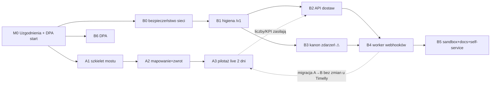

# Roadmapa pracy — API integracji Timelly (Delivery API)

> Plan wykonawczy. Data: 2026-07-08. Spina: `10-KONTRAKT-PARTNERSKI-API-v1.md` (kontrakt `/v1`),
> `03-ANALIZA-LUK.md` (pakiet IR v1, luki L1–L24), `00-STAN-OBECNY.md` (co już mamy), `11-PLAN-PILOTAZ-TIMELLY.md`.
> **Wykonanie idzie protokołem zmian Ziomka** (`memory/ziomek-change-protocol.md`, ETAP 0→7); każdy flip flagi /
> restart / deploy silnika = jawne ACK Adriana, poza peakiem.

## 0. TL;DR — strategia dwutorowa

Timelly = platforma zamówień, chce nas jako **flotę** (Delivery-as-a-Service): zlecenie z ich systemu → do nas
automatem, statusy + tracking wracają. Nie budujemy od zera — ~60% fundamentu istnieje (uśpiona warstwa integracji,
model webhooków HMAC, tracking `/t/{token}`, wzorzec mostu Papu). Idziemy **dwoma torami równolegle**:

- **TOR A — most pilotażowy (szybka wartość, tygodnie):** klon `papu_dispatch_bridge`. Uruchamia pełną pętlę na
  1–2 restauracjach zanim dojrzeje API publiczne. Ryzyko gastro-w-środku przyjęte świadomie (tak działa dziś Papu).
- **TOR B — publiczne API `/v1` (docelowe, skalowalne, ~kwartał):** wycinek pakietu IR v1. Kontrakt `/v1` (dok. 10) jest
  stały, więc **migracja Timelly A→B nie wymaga zmian po ich stronie.** Ten tor jest też fundamentem pod kolejnych
  partnerów (Restimo, Restaumatic, POS).

Kolejność wartości: **A daje pilotaż i liczby szybko; B buduje się w tle i przejmuje ruch po domknięciu kanonu zdarzeń.**

## 1. Reużywamy vs budujemy (żeby nie dublować)

| Reużywamy (istnieje w kodzie) | Budujemy (luki IR v1) |
|---|---|
| `IntegrationConnection` (klucz API SHA-256, scope tenant+lokal, rotacja) | Worker webhooków HTTP push (L1) — **nie istnieje** |
| `ingest_inbound_order` (idempotencja, `needs_review`) | `POST /v1/deliveries` dla toru **jedzenia** spięte z OPS-02 (L2) |
| `create_delivery` + `_push_to_ziomek` (ścieżka formularza restauracji) | Kanon zdarzeń: most silnik→`StatusEvent` + maszyna przejść jedzenia (L4) |
| Model webhooków AUT-08 (subskrypcje, HMAC, `event_id`, `OutboundDeliveryLog`) | Spięcie quote→create (`quote_id`, TTL) (L3) |
| Tracking `/t/{token}` + SMS (poziom liderów) | Higiena `/v1`: model błędów, rate-limit na kluczu, CORS (L8/L13) |
| Wzorzec **mostu Papu** (inbound HMAC + zwrot kuriera/ETA) | Sandbox + symulator stanów + developer portal (L10/L11) |
| Wzorzec retry-cronów (FOR UPDATE SKIP LOCKED + exp backoff) | Self-service onboarding + panel połączeń (L12) |
| Geofence 5b (`gps_arrived_at`) = przyszły sygnał POD | `GET /v1/delivery-areas`, COD w kontrakcie publicznym (L15/L16) |

## 2. Kamień milowy 0 — Uzgodnienia (PRZED kodem)

| # | Zadanie | Właściciel | Wynik |
|---|---|---|---|
| M0.1 | Call techniczny Timelly: domknięcie kontraktu pól/webhooków (dok. 10), wybór kierunku **pull (most)** vs **push (`/v1`)** na pilotaż | Adrian + inż. | protokół ustaleń |
| M0.2 | Timelly wystawia: 2 endpointy HMAC (most) **lub** webhook URL (`/v1`) + potwierdza format godziny odbioru i obsługę anulacji | Timelly | endpointy + sekret HMAC |
| M0.3 | Lista restauracji pilotażowych + ich numeryczne id do mapy | Adrian | `restaurant_map` seed |
| M0.4 | Zlecenie prawnikowi: wzorzec umowy powierzenia (DPA/RODO) — **blocker produkcji** (IR-6/L24) | prawnik + Adrian | wzorzec DPA |
| M0.5 | Sekrety (HMAC, dostęp) w `.secrets/` bezpiecznym kanałem | inż. | sekrety na serwerze |

**Bramka:** bez M0.1–M0.3 nie ruszamy kodu integracji (unikamy budowy na domysłach — Lekcja „pytaj nie zgaduj").

## 3. TOR A — Most pilotażowy (klon Papu)

Osobny proces (systemd oneshot + timer), jak istniejące mosty. Cel: pełna pętla na żywo w tygodnie.

| Sprint | Zakres | Zadania | Nakład | DoD (dowody) |
|---|---|---|---|---|
| **A1** — szkielet | klon `papu_dispatch_bridge`→`timelly_dispatch_bridge` | klient API Timelly (HMAC), parser pól (adres/telefon/restauracja/godzina/uwagi/płatność), marker `#TL:<id>` idempotencji, config | ~2 dni | `--dry-run` przechodzi na danych testowych; 0 podwójnych wstrzyknięć w teście |
| **A2** — mapowanie + zwrot | `restaurant_map.json`, `city_map.json`, przepływ powrotny statusu/kuriera/ETA | wstrzyknięcie do gastro (`add-zamowienie`), odczyt `panel_client`, push statusu do Timelly (HMAC), alerty OnFailure→Telegram | ~1–2 dni | E2E `--dry-run` obie strony; parytet pól gastro↔Timelly; alerty działają |
| **A3** — pilotaż live | 1–2 restauracje, obserwacja 2 dni | enable timer (ACK, off-peak), monitoring, pomiar KPI (§9) | ~0,5 dnia + 2 dni obs. | pełna pętla na realnym zleceniu; KPI zebrane; rollback przetestowany |

**Rollback A:** `systemctl disable --now dispatch-timelly-bridge.timer` (stan+log zostają).
**Ryzyko A:** gastro w ścieżce (scraping + subprocess) = pojedynczy punkt awarii — przyjęte w v1; SLA komunikować realistycznie.

## 4. TOR B — Publiczne API `/v1` (wycinek IR v1)

Każda faza dotyka warstwy API panelu / silnika → **pełny protokół ETAP 0–7**. Odniesienia = sekcje kontraktu (dok. 10).

### B0 — IR-0: Warunki wstępne bezpieczeństwa (L14) · nakład S
- **Cel:** zanim cokolwiek wystawimy publicznie — host-firewall + bind lokalny 127.0.0.1 dla courier-api/OSRM/gps
  (dziś 0.0.0.0 tylko za Hetzner Cloud FW); publiczna powierzchnia wyłącznie przez nginx 443.
- **Zadania:** ufw/nftables reguły, przegląd bindów, przegląd sekretów połączeń.
- **DoD:** skan portów z zewnątrz = tylko 443; usługi wewn. nieosiągalne spoza hosta; testy bazowe zielone.
- **Bramka:** ACK + off-peak (zmiana sieci).

### B1 — IR-1: Higiena powierzchni (L8/L9/L13) · nakład M
- **Cel:** stabilny, spójny kontrakt `/v1`.
- **Zadania:** prefiks `/v1`; **model błędów** `{error_code,reason,details}` + katalog (`DROPOFF_OUTSIDE_OF_DELIVERY_AREA`,
  `DUPLICATE_ORDER`, `QUOTE_EXPIRED`, `CANCELLATION_WINDOW_PASSED`, `VALIDATION_ERROR`); **jedna idempotencja**
  `external_delivery_id` (mapowana na istniejące `idempotency_key`/`Idempotency-Key`/`event_id` — nie 5. wariant);
  rate-limit na kluczu API (slowapi per connection); CORS dla domen integratorów. (Kontrakt §2, §10)
- **DoD:** ten sam `external_delivery_id` z tymi danymi→200, z innymi→409 (test ON≠OFF); model błędów w testach; limit działa.
- **Bramka:** ACK; flaga powierzchni OFF do czasu B2.

### B2 — IR-2: API dostaw jedzenia (L2/L3/L5/L6/L7/L15/L16) · nakład L
- **Cel:** `POST /v1/deliveries` (tor jedzenia) spięte z **istniejącą** ścieżką `create_delivery`+`_push_to_ziomek`
  (NIE drugi silnik) + wycena, odczyt, anulacja, strefy, COD, tracking_url.
- **Zadania:** `POST /v1/quotes` (`quote_id`, `fee` w groszach, `expires_at` TTL) → create przyjmuje `quote_id` (§3, §4);
  `POST /v1/deliveries` z polami kontraktu (`pickup_at`→`czas_kuriera` frozen ETA, `payment.cod`, `contactless`, `notes`) (§4, §5);
  `GET /v1/deliveries/{external_delivery_id}` (§6); `POST .../cancel` z `reason` + polityką okna + polem `cancellable` (§7);
  `GET /v1/delivery-areas` (§11); `tracking_url` w odpowiedzi create (§1). Reużyć silnikowe feasibility/`shadow_quote`.
- **DoD:** utworzenie→plan kuriera bez dublowania toru; wycena spięta z create; anulacja respektuje okno; poza obszarem→422;
  PEŁNA regresja panelu + silnika; E2E przez wszystkie dotknięte warstwy.
- **Bramka:** ACK; flaga `AUT06_POS_INTEGRATION` flip = zmiana live, off-peak.

### B3 — IR-3: Kanon zdarzeń (L4) · nakład L · **⚠ SERCE / ŚCIEŻKA KRYTYCZNA**
- **Cel:** JEDEN kanon statusu, z którego wychodzą webhooki (dziś 3 rozjechane światy; panel maruderem).
- **Zadania:** most **silnik→`StatusEvent`** w czasie rzeczywistym (każde zdarzenie `event_bus` toru jedzenia:
  ASSIGNED/PICKED_UP/DELIVERED/RETURNED + anulacja); rozszerzyć maszynę przejść (`ALLOWED_TRANSITIONS`) na tor jedzenia;
  jawna obsługa gastro 8/9 → `FAILED`/`CANCELLED`; mapowanie stanów silnika → kanon 10 (§9 kontraktu).
- **DoD:** partner NIGDY nie dostaje `delivered` a potem `picked_up` (test resurrect); każde przejście = dokładnie jedno
  zdarzenie kanonu; parytet: stan silnika == `StatusEvent` == webhook.
- **Bramka:** ACK. **Webhooki (B4) NIE mogą być publicznie włączone przed stabilnym B3** (kłamiące statusy = spalony partner).

### B4 — IR-4: Worker webhooków (L1) · nakład M
- **Cel:** statusy wychodzą pushem, niezawodnie.
- **Zadania:** worker HTTP push (wzór retry-cronów: FOR UPDATE SKIP LOCKED + exp backoff, cap); podpis
  `Nadajesz-Signature: t=,v1=HMAC-SHA256("t.body")` (§8); ACK=2xx; wersjonowany payload; `event_id` idempotencja u odbiorcy;
  `tracking_url` w każdym zdarzeniu; zdarzenie `delivered` niesie POD (`delivered_at`+`gps`) i wynik COD.
- **DoD:** dostarczenie przy 2xx, ponawianie przy błędzie (test), podpis weryfikowalny stałoczasowo, brak duplikatów u odbiorcy;
  metryka dostarczalności w `OutboundDeliveryLog`.
- **Bramka:** ACK; flaga `AUT08_OUTBOUND_API` flip po B3 stabilnym, off-peak.

### B5 — IR-5: Sandbox + docs + self-service (L10/L11/L12) · nakład M/L
- **Cel:** partner onboarduje się bez naszego kodu.
- **Zadania:** test-tenant + klucze testowe + **symulator stanów** (`POST /v1/test/deliveries/{id}/advance` wzór DoorDash);
  developer portal `developers.nadajesz.pl` (redoc z routera `/v1` + przewodniki auth/webhooki/statusy/sandbox + przykłady curl);
  aktywacja `connections` + panel UI (klucz raz, rotate, status live, „test").
- **DoD:** zewnętrzny dev przechodzi pełny scenariusz w sandbox bez naszego wsparcia; docs publicznie osiągalne.
- **Bramka:** ACK.

### B6 — IR-6: Formalności (L24) · nakład S (równolegle z M0.4)
- **Cel:** DPA/RODO gotowe przed 1. produkcyjnym zleceniem (my = podmiot przetwarzający dla restauracji/Timelly-administratora).
- **DoD:** podpisany wzorzec powierzenia; zapisy retencji; tracking min-PII potwierdzony.

## 5. Sekwencja i ścieżka krytyczna

- **Ścieżka krytyczna TOR B:** `B0 → B1 → B3 → B4` (kanon zdarzeń przed webhookami).
- **TOR A** biegnie równolegle i niezależnie — daje pilotaż zanim B4 gotowe.
- **B2 i B3 równolegle** po B1 (różne warstwy), ale flip webhooków dopiero po B3.

## 6. Bramki protokołu Ziomka (per faza dotykająca silnika/panelu)

Dla KAŻDEJ fazy B (i A3 przy enable timer): **ETAP 0** stan+testy bazowe zielone, snapshot flag (3 światy, ADR-004) →
**ETAP 1** fix/wpięcie u źródła (reużycie `create_delivery`/`ingest_inbound_order`/`event_bus`, nie łatka) →
**ETAP 2** SOFT nie osłabia HARD (R-DECLARED-TIME/R-35MIN/feasibility nietknięte; `pickup_at`→`czas_kuriera` frozen) →
**ETAP 3** mapa kompletności (bliźniacze ścieżki RAZEM: serializer statusu, wszystkie przejścia kanonu, każdy konsument idempotencji) →
**ETAP 4** dowody: flaga ON≠OFF (test), zdarzenia w logu, parytet, PEŁNA regresja + E2E przez dotknięte warstwy →
**ETAP 5** „warto + bez regresji": pilotaż = dowód pętli, okno obserwacji 2 dni →
**ETAP 6** backup→py_compile→test→git log→**ACK**→1 restart/flip (NIGDY telegram/peak bez OK) →
**ETAP 7** rollback gotowy.

**Flipy live (wymagają ACK, off-peak):** `AUT06_POS_INTEGRATION` (po B2), `AUT08_OUTBOUND_API` (po B3 stabilnym).

## 7. Nakład zbiorczy i harmonogram względny

| Blok | Nakład | Uwaga |
|---|---|---|
| TOR A (most, pilotaż) | ~**3–5 osobodni** | przy gotowych 2 endpointach Timelly (M0.2) |
| TOR B — wycinek dla Timelly (B0–B4) | ~**6–9 osobotygodni** | B2+B3 = gros; B3 krytyczne |
| TOR B — pełne IR v1 (+B5 sandbox/docs/self-service, B6) | ~**10–14 osobotygodni** | fundament pod kolejnych partnerów |

Sekwencja sprintów (bez twardych dat — **daty = decyzja Adriana**): M0 → [A1–A3 || B0–B1] → [B2 || B3] → B4 (flip) → B5.
Kolejne partnerstwa (Restimo/Restaumatic) startują handlowo równolegle od M0 (patrz `06`/`08`).

## 8. Ryzyka i mitigacje

| Ryzyko | Mitigacja |
|---|---|
| Kłamiące statusy (3 światy stanu) | B3 (kanon) PRZED flipem webhooków; parytet w DoD B3 |
| Gastro w ścieżce krytycznej (SPOF) | świadomie przyjęte w v1; obejście = L21 etap 2 (XL, osobny program), API `/v1` już gotowe na przejście bez zmian kontraktu |
| Duplikaty zleceń przy retry mostu/partnera | jedna idempotencja `external_delivery_id` (B1); marker `#TL:` w moście (A1) |
| Flip flagi = zmiana live | protokół ETAP 6, ACK, off-peak, rollback per-flaga (hot-reload) |
| Brak DPA przed produkcją | B6/M0.4 równolegle od dnia 0; blocker 1. produkcyjnego zlecenia |
| Wystawienie portów przed hardeningiem | B0 warunkiem wstępnym wystawienia `/v1` publicznie |

## 9. Metryki sukcesu (KPI)

- **Pętla:** % zleceń Timelly przyjętych→dostarczonych automatem (0 ręcznego przepisywania).
- **Czas odbioru:** realny odbiór vs `pickup_at` (deklaracja) — mediana i p90 (reguła R27 ±5).
- **Statusy:** dostarczalność webhooków (2xx / ponowienia), 0 przypadków cofnięcia stanu (delivered→picked_up).
- **Idempotencja:** 0 podwójnych kursów przy retry.
- **Latencja:** `POST /v1/deliveries` p95.
- **Jakość:** oceny klienta końcowego z `/t/{token}`, % dostarczonych na czas.

## 10. Otwarte decyzje Adriana

- **Kierunek pilotażu:** most (A, my pullujemy Timelly) vs od razu `/v1` (B, oni pushują). Rekomendacja: **A + B równolegle**.
- **Daty / kolejność sprintów** względem pozostałych priorytetów Ziomka (P1–P6).
- **Cennik / model rozliczeń** (flat fee per dostawa + faktura zbiorcza) — do kontraktu handlowego.
- **Zakres B5 na start** — pełny developer portal od razu czy dopiero po 2. partnerze.

---
*Powiązane: `10-KONTRAKT-PARTNERSKI-API-v1.md` (kontrakt `/v1`), `03-ANALIZA-LUK.md` (IR v1, luki), `00-STAN-OBECNY.md`
(stan), `11-PLAN-PILOTAZ-TIMELLY.md` (pilotaż), `08-RAPORT-KONCOWY.md` (kroki 14/30 dni), `memory/ziomek-change-protocol.md`.*
