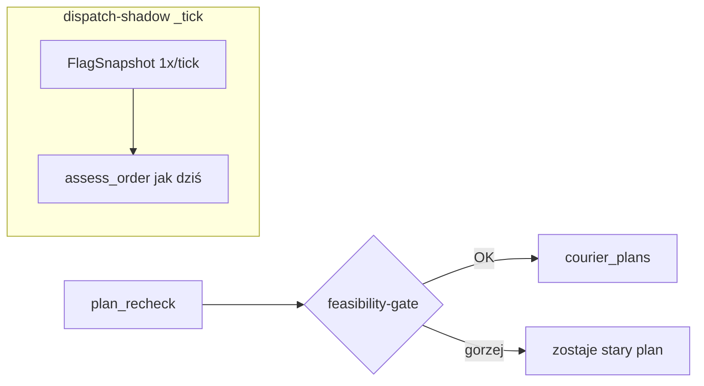
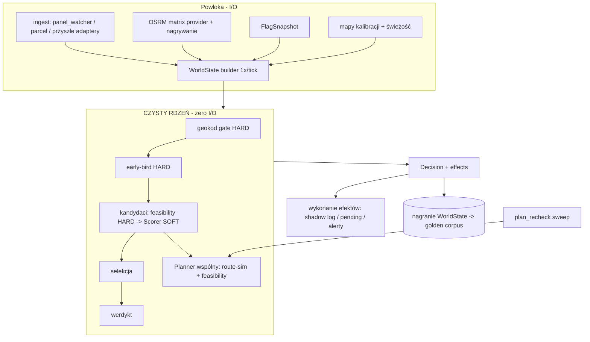
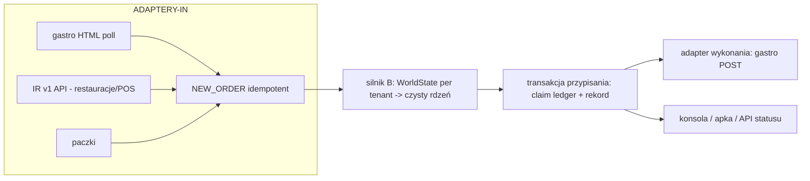

# 03 — Architektura docelowa (Faza 3: warianty, nie dogmat)

**Data:** 2026-07-06 · **Wejście:** diagnoza `02-diagnoza.md` (D1-D10) + kanon `ZIOMEK_ARCHITECTURE.md` (6 filarów F-1..F-6 + 8 kontraktów, **zatwierdzony przez Adriana 01.07**) + wymagania Fazy 0 (cel: ~400 zam/d, **multi-tenant**, integracje wg `docs/integracje/` IR v1; tick 3 min OK; JSONL/state = kontrakt publiczny; shadow+replay = staging).

**Zasada nadrzędna:** kanon 6 filarów JUŻ definiuje stan docelowy — warianty poniżej to **trzy różne głębokości dojścia do niego**, nie trzy różne architektury. Skala adekwatna: 240→400 zam/d, ~62 kurierów, 1 miasto → **żaden wariant nie wprowadza brokera, CQRS ani nowej bazy** (dowód adekwatności: dzisiejszy monolit robi p95=1,6 s na decyzję przy 240/d — problem jest w splątaniu, nie w przepustowości).

---

## WARIANT A — minimalny (chirurgia punktowa: zdjęcie ryzyk 4-5 bez ruszania struktury)

**Zakres (leczy D1, D3, D4-lokalnie, D5-częściowo, D6):**
1. **Kroki zerowe:** naprawa schematu `postpone_sweeper` (albo wygaszenie timera za ACK) + delta-kanon dla `telegram_approver.save_pendning` + mkstemp w `global_alloc_store` + fcntl w `courier_last_pos` (D1 + backlog W4/W5).
2. **Lint/typecheck ratchet** (D3): osobny venv narzędziowy; ruff+mypy na baseline „nie gorzej" (nowe naruszenia = czerwono), bez wielkiego sprzątania.
3. **FlagSnapshot per tick** (D5/D6-częściowo): jeden odczyt `flags.json` na początku ticku → dict w dół; `C.flag()` dostaje tryb „snapshot-first". Zabija ~700 odczytów dysku/decyzję i niespójność flag w środku decyzji.
4. **Bramka feasibility na wyjściu `plan_recheck._sweep`** (D4-lokalnie): nowa sekwencja przechodzi `check_feasibility_v2`-lite (R6/committed) albo zostaje stara; parytet env drop-inów obu procesów recanon.

**Trade-offy:** najszybciej zdejmuje ryzyka o wpływie 4-5 i czerwone SLO; NIE dotyka monolitu, więc koszt każdej PRZYSZŁEJ zmiany silnika pozostaje wysoki; testowalność rdzenia poprawia się tylko trochę (flagi deterministyczne, OSRM nadal żywy).
**Koszt migracji:** ~5-7 PR ≤400 linii, 1-2 tygodnie okien poza peakami. Ryzyko niskie (każdy krok za flagą, rollback = flaga/revert).
**Czego NIE rozwiązuje:** D2 (rdzeń dalej spleciony), D7 (pozycja ×4), D8 (multi-tenant), D9 (replay), D10 (route-order ×4). Kanon F-1/F-2 pozostaje niezrealizowany — dług strukturalny rośnie dalej.

## WARIANT B — umiarkowany: pełna realizacja filarów F-1/F-2 metodą stranglera ⭐ REKOMENDOWANY

**Idea:** A jest podzbiorem B (kroki zerowe identyczne). Dalej — czysty rdzeń i jedno źródło świata, wycinane z monolitu **etapami, bez rewrite'u**:

1. **WorldState (F-1):** budowany RAZ na tick — snapshot floty (z jawną hierarchią źródeł pozycji → leczy D7 od strony konsumenta), zleceń, flag (z A), kalibracji (eta_quantile_map itd. z metadanymi świeżości), `now`. Wszystkie warstwy KONSUMUJĄ, nie re-derywują.
2. **Czysty rdzeń `decide(world, order) → Decision` (F-2):** wydzielany z `_assess_order_impl` po szwach, które JUŻ istnieją (raw/01b): najpierw wstrzyknięcie `TravelTimeProvider` (macierz OSRM liczona przed/poza rdzeniem, z nagrywaniem), potem przenoszenie bloków warstwa po warstwie (geokod-gate → early-bird → pętla kandydatów → selekcja → werdykt) do modułów. `scoring`/`route_sim`/`objm_lexr6` są JUŻ czyste — to kotwice.
3. **Powłoka efektów:** shadow-writy, load-governor, Telegram, event-emit zbierane jako `effects: list` w wyniku decyzji i wykonywane PO rdzeniu (nazwane helpery `_emit_*`/`_append_*` = gotowe punkty przecięcia).
4. **plan_recheck przez TEN SAM rdzeń planowania (D4 u źródła):** wspólny `Planner` (route-sim + feasibility) używany przez tick ORAZ sweep — koniec „drugiego rdzenia omijającego HARD" i koniec znaczenia env-rozjazdu (flagi z WorldState, nie z env procesu).
5. **Wymienne strategie scoringu (wymóg briefu):** interfejs `Scorer` — dzisiejsza heurystyka jako implementacja domyślna; LGBM jako strategia za flagą z **fallbackiem heurystycznym** (dziś i tak shadow — interfejs formalizuje przyszły flip bez przebudowy).
6. **Nagrywanie WorldState + macierzy OSRM per decyzja (D9):** naturalny produkt uboczny F-1 → **golden corpus replay bit-w-bit** → bramka CI (F-6) i realne „testy charakteryzujące" przed każdym krokiem stranglera.

**Trade-offy:** realizuje zatwierdzony kanon (F-1/F-2/F-6 w całości, F-3/F-5 częściowo) i odblokowuje wszystko dalej (testy deterministyczne, tani rozwój, przyszły multi-tenant); wymaga dyscypliny stranglera (każdy krok = parytet bajt-w-bajt ze starą ścieżką za flagą) i ~2× dłuższego kalendarza niż A; przez czas migracji żyją DWIE ścieżki (stara/nowa za flagą) — koszt poznawczy dla innych sesji (mitygacja: rejestr kroków w `05-dziennik.md` + wpisy w CODEMAP).
**Koszt migracji:** ~15-20 PR ≤400 linii, realnie 6-10 tygodni w oknach poza peakami/So-Nd, bez big-bangów; każdy krok samodzielnie wdrażalny i odwracalny (flaga → OFF = stara ścieżka).
**Czego NIE rozwiązuje:** D8 (granica multi-tenant — przygotowuje, nie wdraża); D10 w pełni (unifikacja route-order cross-repo = osobny tor, koordynowany z pracą Sprint 0/tmux 15 — B daje wspólny Planner w silniku, czyli 1 z 4 kopii staje się kanonem konstrukcyjnym); rozbiórki `common.py` do końca (tylko wyjęcie flag/kar do modułów wg potrzeb kroków).

## WARIANT C — docelowy przy wzroście: granice pod multi-tenant i integracje (nadbudowa NAD B)

**Warunek wejścia:** B ukończony + decyzja biznesowa o pilotażu 2. tenanta/integracji IR v1 (pakiet w `docs/integracje/` gotowy). Bez tych dowodów NIE wchodzić — elementy C bez B to dekoracja.

1. **TenantContext w WorldState:** bbox/strefy/progi per miasto-tenant z configu (koniec hardcode `coords_in_bialystok_bbox` jako stałej globalnej); state-files i logi z wymiarem tenanta (nowe pola ADDITIVE — kontrakt JSONL nietykalny, stare pola zostają).
2. **Ingest jako adaptery:** dzisiejszy gastro-HTML poll = adapter #1; IR v1 API (model Wolt Drive) = adapter #2 o tym samym kontrakcie NEW_ORDER (idempotentne event_id już jest). Silnik nie wie, skąd zlecenie.
3. **Przypisanie jako transakcja silnika:** claim-ledger ON (po dowodzie ETAP 5) + rekord przypisania w silniku; gastro przechodzi z „źródła prawdy przypisań" do „adaptera wykonania" (POST jak dziś, ale prawda = silnik). **To zmiana kontraktu → wymaga osobnej, jawnej zgody Adriana** (dziś: prawda = gastro, patrz D8).
4. **Idempotencja na granicach:** formalny kontrakt eventów na ISTNIEJĄCYM `events.db` (żadnego brokera — 400/d to ~1 zlecenie/2 min w peaku; SQLite + pliki wystarczą z zapasem rzędu wielkości).

**Trade-offy:** jedyna droga do celu 12-mies. (multi-tenant + integracje); przenosi prawdę przypisań do silnika = zmiana odpowiedzialności operacyjnej (wymaga okresu shadow: silnik prowadzi rekord równolegle z gastro i mierzy rozjazdy). **Koszt:** L (kwartał+, w tym zależności zewnętrzne: partnerzy IR, pilot). **Czego NIE rozwiązuje:** HA/drugi serwer (osobna decyzja Adriana), pełny F-3 (typy domenowe wszędzie), rozbiórka konsoli/apki z importu biblioteki na API (kierunek, osobny program).

---

## PORÓWNANIE: który wariant leczy który problem

| Problem (z 02) | A | B | C |
|---|---|---|---|
| D1 miny armed-on-flip | ✅ | ✅ | ✅ |
| D2 rdzeń ⨯ środowisko | 🟡 flagi | ✅ pełne F-1/F-2 | ✅ |
| D3 lint/typecheck | ✅ | ✅ | ✅ |
| D4 plan_recheck/HARD | 🟡 bramka | ✅ wspólny Planner | ✅ |
| D5 flagi 3 światy | 🟡 snapshot | ✅ snapshot+rejestr w WorldState | ✅ |
| D6 perf SLO | 🟡 duży krok (flagi) | ✅ (+ macierz OSRM 1×) | ✅ |
| D7 pozycja ×4 | ❌ | 🟡 hierarchia w WorldState | ✅ (1 store docelowo) |
| D8 multi-tenant/granica gastro | ❌ | 🟡 przygotowanie | ✅ |
| D9 replay bit-w-bit | ❌ | ✅ nagranie WorldState+OSRM | ✅ |
| D10 route-order ×4 | ❌ | 🟡 kanon konstrukcyjny w silniku | 🟡 (pełna unifikacja = tor z tmux 15) |

## REKOMENDACJA

**B, realizowany tak, że A = jego pierwsze 5-7 PR** (kroki zerowe i FlagSnapshot są identyczne w obu — nie ma decyzji „A albo B" do podjęcia teraz w kodzie, jest decyzja o horyzoncie). **C zatwierdzić kierunkowo** (ADR-R05) i uruchamiać dopiero po B + decyzji biznesowej o 2. tenancie/IR — zgodnie z zasadą skali adekwatnej.

Uzasadnienie: (1) B realizuje kanon, który już zatwierdziłeś 01.07 — to nie nowa wizja, to plan dojścia; (2) cel 400/d+multi-tenant czyni A niewystarczającym (zostawia D2/D7/D8/D9); (3) C bez B = przybudówki na splątanym rdzeniu — dokładnie anty-wzorzec „łatka nie źródło".

## ADR-y (szczegóły w `adr/`)

| ADR | Decyzja | Status |
|---|---|---|
| R01 | FlagSnapshot: flagi czytane RAZ na tick, przekazywane w WorldState | proponowany |
| R02 | Czysty rdzeń `decide(world)` + powłoka efektów; strangler za flagami, nigdy rewrite | proponowany |
| R03 | Jeden Planner (route-sim+feasibility) dla ticku I plan_recheck | proponowany |
| R04 | Nagrywanie WorldState+macierzy OSRM = golden corpus; replay = bramka CI | proponowany |
| R05 | Multi-tenant przez adaptery ingest/wykonania; prawda przypisań → silnik (kierunkowy, aktywacja za osobną zgodą) | proponowany-kierunkowy |
| R06 | Scorer jako strategia wymienna z fallbackiem heurystycznym | proponowany |

---
*Artefakt Fazy 3. STOP: wybór wariantu przez Adriana → potem Faza 4 (plan migracji strangler).*
